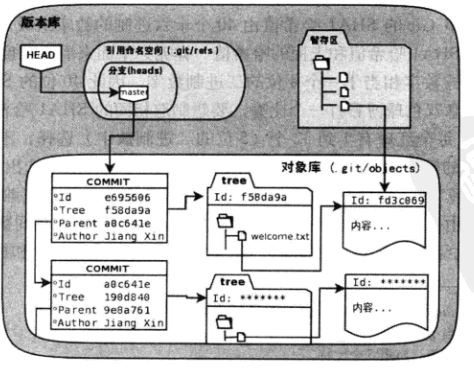

## Git

### 1. git 基础

git 的文件生命周期


本地基本指令

``` bash
git status: 查看当前文件状态
git diff： 查看修改
git rm: 删除暂存区和工作区的文件
git rm --cached：仅删除暂存区的文件，不影响工作区
git mv from to: 将文件from改名为to
git log: 查看提交历史

git reset --hard <commit_id>:修改master引用、工作区和暂存区
git reset <commit_id>：将改动撤出暂存区，相当于git add 的反向操作
git reset --soft：引用回退一次，工作区和暂存区不影响
```

远程仓库指令

``` bash
git remote -v: 查看远程仓库
git remote add origin url: 添加远程仓库，origin为名字,url为远程仓库地址
git remote rm origin: 删除远程仓库origin
git remote rename or origin：重命名
```

### 2. git分支

分支本质上是一个指向提交对象的 **可变指针**

**<font color=red>HEAD指向当前正在工作的本地分支</font>**


git 分支指令

``` bash
git branch test：创建test分支
git checkout test：切换到test分支
git checkout -b test：创建并切换到test分支
git merge test: 合并test分支，一般在master分支执行
```


### 3. Git 原理

#### 3.1 git结构

git 保存的是 **快照**，**不是文件改动**

git结构：

- 工作区
- 暂存区：图中 index部分
- 目录树：图中 master 所代表部分
- objects：git 的对象库


版本库的具体实现，master 指向最新的提交，HEAD 指向当前工作分支的最新提交



操作对 git 结构的影响：

- 文件更改：修改工作区的文件
- git add：更新暂存区的目录树
- git commit：暂存区的目录树写到对象库中，master 分支相应更新
- git reset HEAD：暂存区的目录树被 master 指向的目录树替换，工作区不影响
- git rm --cached：从暂存区删除文件，工作区不影响
- git checkout：使用暂存区的相应文件替换工作区的文件

