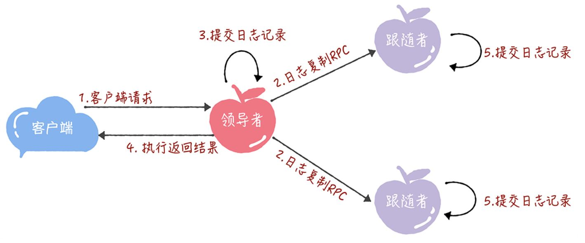
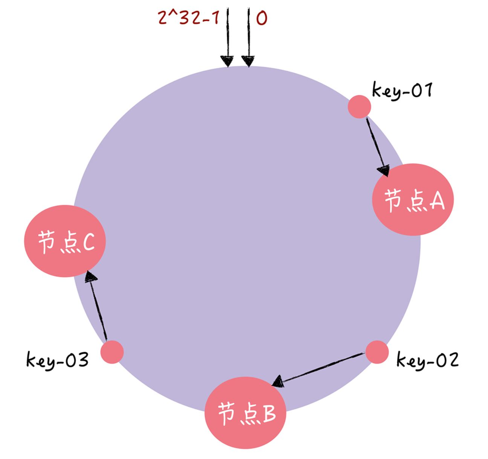

[toc]

## 分布式

### 1. 分布式基础

#### 1.1 CAP 理论

CAP 是分布式系统的三个指标：

- Consistency：**一致性**，各节点的数据一致，客户端访问任何节点得到相同的数据或者都读取失败；
- Availability：**可用性**，客户端访问任何节点都能得到数据；
- Partition Tolerance：**分区容错性**，系统内部的数据同步不影响服务。

CAP 不能同时满足，只能实现其中两个：CP（强一致），AP（最终一致），CA（单机系统）

#### 1.2 BASE 理论

BASE 理论是 CAP 中的 AP 的发展，包括：

- Basically Availability：**基本可用**，在出现不可预知的故障后系统仍能使用；
- Soft state：**软状态**，允许不同节点的数据副本存在延时；
- Eventually consistent：**最终一致**，在一定期限后能实现数据一致；DNS 是常见的最终一致性应用之一

### 2. 一致性算法

#### 2.1 理论基础

##### 2.1.1 主从同步

思想：

- Master 接受写请求；
- Master 复制日志到 slave；
- Master 等待直到所有从库返回

问题：一个节点失败将导致整个集群不可用

##### 2.1.2 多数派

思想：每次读或写操作会在超过一半节点完成。

问题：并发环境下无法保证系统正确性，写操作先后顺序对正确性有影响

#### 2.2 Basic Paxos 算法

##### 2.2.1 介绍

Paxos 算法用于对 **某个值（不仅仅是数值，也可以是日志等等）达成一致**。最多可以容量一半的设备发生故障。

角色介绍：

- Client：请求发起者；
- Propser：接受 Client 请求，向集群提出提议；
- Accpetor：提议投票和接收者；当提议为多数派时才会被接受；
- Learner：提议接收者，负责备份，不影响集群一致性。

##### 2.2.2 算法

步骤：二阶段提交

- 准备阶段：Client 向 Propser 发起请求，Propser 向 Accpetor 发送提案编号的准备请求（不带提议的值）。

  

  如果 Accpetor 之前未通过提议，则返回 “尚无提案”，并不再接受小于接受编号的提案。

  

- 接受阶段：Propser 收到 **超过一半** 的准备响应后，根据提案编号最大的提案的值，设置请求值。

  

  Accpetor 根据编号拒绝或者接受请求，最终对目标值达成一致，并将结果发送给 Learner。

  

不足：

- 只能就单值形成一致；
- 由于不断提交新提案号，但是未通过，从而导致活锁。解决方法：提案未通过时设置时间，规定时间内不能提交。

#### 2.3 Raft 算法

##### 2.3.1 介绍

Raft 算法以领导者为准的方式，实现一系列值的共识和节点日志的一致。

节点状态：

- 跟随者：接收和处理领导者的消息，如果领导者心跳信息超时，则推荐自己当候选人；
- 候选人：向其他节点发送请求投票，如果赢得大多数选票，则成为领导者；
- 领导者：主要负责处理与请求、管理日志复制和发送心跳信息；集群中只能有一个。

##### 2.3.2 算法

- 选举领导者

  - 节点等待领导者的心跳时间是随机的；
  - 发生超时后，节点增加自己的任期编号，并向其他节点发送请求投票 RPC 信息；
  - 其他节点如果在该任期未投票，则将该票投给发送请求的节点，并增加自己的任期编号；
  - 当候选人成为领导者后，发送心跳包阻止竞选。

- 复制日志：领导者将日志复制 RPC 发送到集群上，如果收到大多数成功响应，则将日志提交到状态机；跟随者等到下一个心跳包或者日志复制 RPC 提交日志，减少通讯开销。

  

  如果日志不一致，跟随者的日志会被领导者强制统一。

- 成员变更：当增加新节点后，可能形成 **脑裂** 问题（变为两个集群，产生两个）。解决成员变更使用 **单节点变更**：一次只增加一个节点，如果增加多个节点则执行多次单节点变更。

#### 2.4 一致性哈希

传统哈希的缺点：

- 采用节点个数作为模，增删节点将导致原先的映射失效，需要重新设置映射，工作量大；
- 机器负载高低不均。

一致性哈希：

- 统一对 2^32 进行取模，将整个哈希空间组织成一个圆环；
- 节点被映射到哈希环上，当使用 key 进行访问时，映射到圆环上，顺时针寻找最近的节点获取/修改值；
- 当增加/删除一个节点时，受影响的最多只有两个节点区间之间的哈希映射；
- 可增加虚拟节点使机器负载均匀。

#### 2.5 ZAB

ZAB：为了保证 **操作的顺序性**。

- 所有数据以主节点为主，主节点实现了队列，并使用其他节点备份；
- 当主节点崩溃，日志最完整的节点成为主节点。