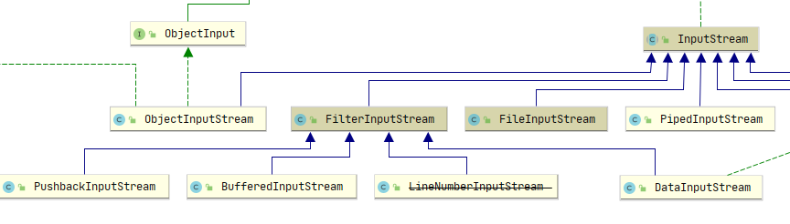

[toc]

# 设计模式

## 设计原则

### 1. SOLID

- S: Single Responsibility Principle，单一职责原则，一个类只负责一个功能。最难以判断的原则
- O: Open Closed Principle，开闭原则，对拓展开放、对修改关闭。要求代码具有拓展性
- L: Liskov Substitution Principle，里氏替换原则，子类能够替换父类出现的任何地方。除了 is-a 关系之外，子类的实现形式(例如从小到大排序)、输入、输出、异常规定需要与父类相同。
- I: Interface Segregation Principle，接口隔离原则，客户端不应该强迫依赖它不需要的接口。将接口的依赖范围最小化。
- D: Dependency Inversion Principle，依赖倒置原则。面向接口编程

### 2. YAGNI

You ain't Gonna Need It. 不要过度设计.

### 3. DRY

Don't Repeat Yourself. 不要写重复代码.

### 4. LOD

Law of Demeter. 尽量减少类之间的依赖.


## 设计模式

### 1. 单例模式

单例模式：一个类只允许创建一个对象。在 java 中，支持在 **类加载器** 级别保证单例。

单例的实现方式：

- 饿汉式：提前初始化会浪费资源.

  ``` java
  public class Singleton {
      private static final Singleton instance = new Singleton();
      
      public static Singleton getInstance() {
          return instance;
      }
      
      private Singleton() {
          
      }
  }
  ```

- 懒汉式

  - 方法锁：在 getInstance() 加了类锁，频繁使用速度慢

    ``` java
    public class Singleton {
        private static Singleton instance ;
        
        public static synchronized Singleton getInstance() {
            if (instance == null) {
                instance = new Singleton();
            }
            return instance;
        }
        
        private Singleton() {
            
        }
    }
    ```

  - 双重检测：volatile 在 jdk 1.5之前并不能保证解决重排序问题，一般不推荐该写法。

    ``` java
    public class Singleton {
        // 高版本jdk可以不加volatile, 高版本jdk new和初始化设计为原子操作 
        private static volatile Singleton instance ;
        
        public static Singleton getInstance() {
            if (instance == null) {
                synchronized(Singleton.class) {
                    if (instance == null) {
                        instance = new Singleton();
                    }
                }
            }
            return instance;
        }
        
        private Singleton() {
            
        }
    }
    ```

- 静态内部类：instance 的唯一性和安全性由 JVM 保证，同时实现了延迟加载。

  ``` java
  public class Singleton {
      
      public static synchronized Singleton getInstance() {
          return SingletonHolder.instance;
      }
      
      private static class SingletonHolder {
          private static final instance = new Singleton();
      }
      
      private Singleton() {
          
      }
  }
  ```

- 枚举

  ``` java
  public enum Singleton {
      INSTANCE;
      // ...
  }
  ```

### 2. 工厂模式

#### 2.1 简单工厂

将生成的过程使用一个工厂类封装

``` java
public final class DatagramHandlerFactory {

    public static DatagramHandler getMessageHandler(Machine machine) {
        switch (machine) {
            case SOURCE:
                return new SourceDatagramHandler();
                ...
        }
        return new DefaultDatagramHandler();
    }
}
```

#### 2.2 工厂方法

让子类决定创建的类型是什么，在此基础上可以为工厂类再创建一个简单工厂

``` java
public interface RuleConfigParserFactory {
    RuleConfigParser create();
}

public class JsonRuleConfigParserFactory implements RuleConfigParserFactory {
    public RuleConfigParser create() {
        return new JsonRuleConfigParser();
    }
}

public class XmlRuleConfigParserFactory implements RuleConfigParserFactory {
    public RuleConfigParser create() {
        return new XmlRuleConfigParser();
    }
}

public class RuleConfigSource {
    public RuleConfig getParser(String type) {
        RuleConfigParserFactory factory = null;
        if ("json".equals(type)) {
            factory = new JsonRuleConfigParserFactory();
        } else if ("xml".equals(type)) {
            factory = new XmlRuleConfigParserFactory();
        } else if (...)
            
        RuleConfigParser parser = factory.create();
    }
}
```

### 3.建造者模式

用途：

- 解决构造函数过多参数调用繁琐的问题

- 上述问题可以用空构造函数和setter解决，但可能会导致对象无效

  ``` java
  // 未设置矩阵的高，对象无效
  Rectangle r = new Rectange();
  r.setWidth(2);
  ```

建造者模式实现

``` java
public class ResourceConfig {
    private String name;
    private int max;
    private int min;
    
    private ResourceConfig(Builder builder) {
        this.name = builder.name;
        this.max = builder.max;
        this.mix = builder.min;
    }
    
    public static class Builder {
        public ResourceConfig build() {
            return new ResourceConfig(this);
        }
        
        public Builder name(String name) {
            this.name = name;
            return this;
        }
        
        public Builder max(int max) {
            this.max = max;
            return this;
        }
        
        public Builder min(int min) {
            this.min = min;
            return this;
        }
    }
}

// 调用
ResourceConfig config = new ResourceConfig.Builder()
                          .name("bzzb")
                          .max(10)
                          .min(5)
                          .build();
```

### 4. 原型模式

对象的创建成本比较大(例如该对象需要从数据库获取全部数据，需要进行大量 IO 操作)，但同一个类的不同对象差别不大，可以利用原有的对象进行复制(深拷贝或浅拷贝)来创建新对象，达到节省创建成本的目的。

### 5. 代理模式

在不改变原有类的情况下，引入代理类来给原始类附加功能

jdk 中的使用： `java.lang.Thread`

``` java
public interface Runnable {
    void run();
}

public class Thread {
    private Runnable r;
    
    public Thread(Runnable r) {
        this.r = r;
    }
    
    public void start() {
        init(); // 创建线程    
        r.run(); // 执行
    }
}
```

### 6.桥接模式

TODO。。。

### 7.装饰者模式

特点：

- 装饰器类和原始类 **继承同样的父类**，可以进行多次装饰
- 装饰器是 **对功能的增强**

使用举例 `java.io`，`PushbackInputStream`、`BufferedInputStream`、`DataInputStream` 继承 `FilterInputStream`，`FilterInpusStream` 是包装原始类，子类增强相应的功能。



``` java
// 包装原始类
public class FilterInputStream extends InputStream {
    protected FilterInputStream(InputStream in) {
        this.in = in;
    }
}

// 包装类
public class DataInputStream extends InputStream implements DataInput {
    public DataInputStream(InputStream in) {
        super(in);
    }
}

// 包装类
public class BufferedInputStream extends FilterInputStream {
    public BufferedInputStream(InputStream in, int size) {
        super(in);
        if (size <= 0) {
            throw new IllegalArgumentException("Buffer size <= 0");
        }
        buf = new byte[size];
    }
}

// 包装类
public class PushbackInputStream extends FilterInputStream {
    public PushbackInputStream(InputStream in, int size) {
        super(in);
        if (size <= 0) {
            throw new IllegalArgumentException("size <= 0");
        }
        this.buf = new byte[size];
        this.pos = size;
    }
}

// 使用
FileInputStream in = new FileInputStream("xxx.txt");
DataInputStream din = new DataInputStream(in); // 包装
```

### 8.适配器模式

适配器模式将不兼容的接口转换为可兼容的接口，举例使用: Slf4j 适配 log4j、logback 等日志实现

适配器分为

- 类适配器：基于继承，适合接口定义 **大部分相同** 的情况，可以直接复用父类接口

  ``` java
  // 要转化成的接口
  public interface Itarget {
      void f1();
      void f2();
      void fc();
  }
  
  // 待转换的类
  public class Adaptee {
      public void fa() { ... }
      public void fb() { ... }
      public void fc() { ... }
  }
  
  public class Adator extends Adaptee implements ITarget {
      public void f1() {
          super.fa();
          ...
      }
      
      public void f2() {
          // 实现f2()...
      }
      // 此处f3不用实现
  }
  ```

- 对象适配器：基于组合，适合接口定义 **大部分不相同** 的情况

  ``` java
  // 要转化成的接口
  public interface Itarget {
      void f1();
      void f2();
      void fc();
  }
  
  public class Adaptor implements ITarget {
      private Adaptee adaptee;
      
      public Adaptor(Adaptee adaptee) {
          this.adaptee = adaptee;
      }
      
      public void f1() {
          adaptee.fa(); // 委托给Adaptee
      }
      
      public void f2() {
          // 重新实现f2()
      }
      
      public void fc() {
          adaptee.fc();
      }
  }
  ```

### 9. 外观模式

外观模式又称门面模式，对外定义一个更大的接口，内部调用小接口(接口整合)，使用更加方便。

### 10.组合模式

组合模式将对象组织成树结构，可以通过递归统一单个对象(叶节点)和组合对象(树根节点)的处理逻辑。组合模式更多是 **对业务场景进行的树形抽象** 。

### 11. 享元模式

享元模式：系统中存在大量重复 **不可变对象**，可以再内存中只保存一份实例，供多处代码引用。

跟单例的区别：享元可以有多个实例，但都是不可变的。

使用举例: `java.lang.Integer` 的缓存

``` java
    public static Integer valueOf(int i) {
        // IntegerCache中缓存了不可变的Integer
        if (i >= IntegerCache.low && i <= IntegerCache.high)
            return IntegerCache.cache[i + (-IntegerCache.low)];
        return new Integer(i);
    }
```


