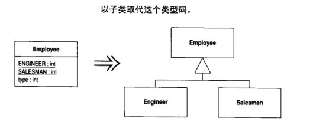
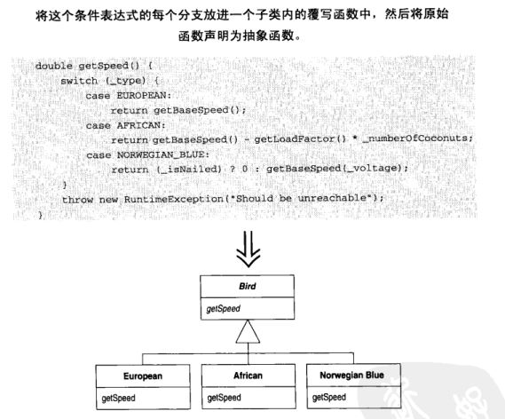

## 重构

#### 1. 坏代码

- 重复代码
- 过长函数
- 过大的类
- 过长的参数
- 高耦合
- 过多 switch/ if else
- 过分的未来拓展性
- 同功能不同名的函数
- 过多注释

#### 2. 重构函数

- 提取并封装函数

- 内联临时变量

  ``` java
  double basePrice = anOrder.basePrice();
  return basePrice > 1000;
  
  // 对临时变量进行内联
  return anOrder.basePrice() > 1000;
  ```

- 引入解释性变量

  ``` java
  if (platform.toUpperCase().indexOf("MAC") > -1 &&
      browser.toUpperCase().indexOf("IE") > -1 &&
      wasInitialized()) {
      // do something
  }
  
  // 引入解释性变量后
  final boolean isMacOs = platform.toUpperCase().indexOf("MAC") > -1;
  final boolean isIEbrowser = browser.toUpperCase().indexOf("IE") > -1;
  if (isMacOs && isIEbrowser && wasInitialized()) {
      // do something
  }
  ```

- 用函数对象封装大函数

#### 3. 重新组织数据

- 设置属性为私有，并通过 getter/setter 访问

- 使用对象封装多个属性

- 以字面常量或者枚举代替魔数

- 使用子类/多态取代类型码

  

- 。。。

#### 4. 简化条件表达式

- 分解条件表达式：将复杂的条件分解为多个独立函数

- 合并：当有多个条件返回同一个值时，合并为一个条件表达式，**前提**：检查不是独立的，可以看作一次检查

- 用卫语言取代嵌套表达式：卫语言即提前使用 return 返回结果

- 使用多态取代条件表达式

  

- 使用空对象代替 null，但会导致 debug 难度加大

#### 5. 简化函数调用

- 将查询函数和修改函数分离

- 多个函数做了类似工作，可以建立单一函数，通过参数设置不同的功能

- 保持对象完整：从某个对象取出若干值作为函数调用参数，改为传递整个对象

  ``` java
  int low = daysTempRange().getLow();
  int high = daysTempRange().getHigh();
  withinPlan = plan.withinRange(low, high);
  
  // 修改后
  withinPlan = plan.withinRange(daysTempRange);
  ```

- 引入参数对象

- 移除不必要的 setter：如果某字段只在构造函数中赋值，则删除该字段的 setter函数

  注：现在的 Spring 框架使用了自动注入，删除 setter 将导致注入失败，需要仔细考虑

- 隐藏函数

- 使用工厂模式代替构造函数，注：Spring 自动注入需要默认构造函数

- 使用异常取代错误码，但异常不能成为条件检查的替代品

#### 6. 处理概括关系

- 将子类相同字段、函数移至超类
- 构建子类：类中的部分特性未被全部实例使用，构建一个子类，将这些特性移到子类中
- 提炼超类、接口