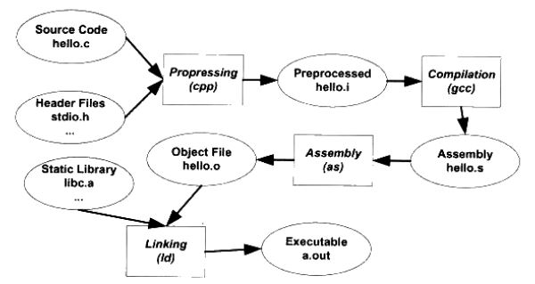
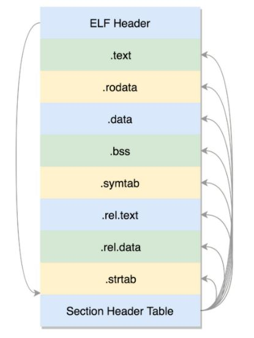

## 链接、装载与库

### 1. 静态链接

#### 1.1 编译和链接

编译程序的步骤：

- 预处理：展开宏定义，处理 #if、#ifdef 等条件预编译指令，处理 #include( 将该文件插入到预编译指令的位置)，去除注释，添加行号和文件名标识（编译错误时进行提醒）
- 编译：得到汇编文件
- 汇编：将汇编代码转为机器指令，得到目标文件
- 链接

为什么需要链接，而不是直接生成可执行文件？软件规模大，需要划分多个模块独立编译，链接的作用是 “组装” 这些模块。

重定位：函数调用或者访问其他目标文件的变量时，在编译时无法确定目标地址，故留下 **重定位入口**，链接时对这些地址进行修正

#### 1.2 目标文件

主流目标文件格式：

- PE：Windows 的目标文件
- ELF：Linux 的目标文件

ELF 文件按 **段** 存储，格式如下：

- Header：包括文件属性和段表，文件属性包含版本、程序入口地址等，段表记录各个段的属性和偏移
- .text：编译好的二进制可执行代码
- .data：已初始化的全局变量和静态变量
- .bss：未初始化的全局变量和静态变量
- .rodata：只读数据
- .symtab：符号表，记录函数和变量

