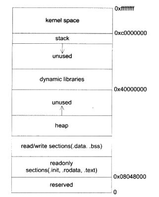
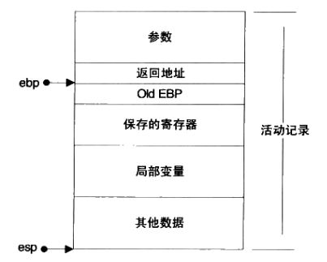

## 链接、装载与库

### 1. 静态链接

#### 1.1 编译和链接

编译程序的步骤：

- 预处理：展开宏定义，处理 #if、#ifdef 等条件预编译指令，处理 #include( 将该文件插入到预编译指令的位置)，去除注释，添加行号和文件名标识（编译错误时进行提醒）
- 编译：得到汇编文件
- 汇编：将汇编代码转为机器指令，得到目标文件
- 链接

为什么需要链接，而不是直接生成可执行文件？软件规模大，需要划分多个模块独立编译，链接的作用是 “组装” 这些模块。

重定位：函数调用或者访问其他目标文件的变量时，在编译时无法确定目标地址，故留下 **重定位入口**，链接时对这些地址进行修正

#### 1.2 目标文件

主流目标文件格式：

- PE：Windows 的目标文件
- ELF：Linux 的目标文件

ELF 文件按 **段** 存储，格式如下：

- Header：包括文件属性和段表，文件属性包含版本、程序入口地址等，段表记录各个段的属性和偏移
- .text：编译好的二进制可执行代码
- .data：已初始化的全局变量和静态变量
- .bss：未初始化的全局变量和静态变量
- .rodata：只读数据
- .symtab：符号表，记录函数和变量
- .rel.data：数据段的重定位表，保存需要重定位的信息
- .rel.text：代码段的重定位表

#### 1.3 静态链接

静态链接的主要步骤：

- 地址和空间分配：将目标文件的各段合并，并分配各个段的 **虚拟地址**
- 符号决议/绑定：计算每个符号(函数，全局变量等)的虚拟地址
- 重定位：进行符号解析，通过 .rel.data、.rel.text 等重定位表 修正指令中重定位入口的地址

### 2. 装载与动态链接

#### 2.1 装载

装载的方式：

- 覆盖载入：程序员手动管理各模块何时读入读出内存，现已不使用
- 页映射：操作系统使用虚拟内存管理内存页换入换出

操作系统角度装载可执行文件：

- 建立进程：创建独立的虚拟地址空间，建立可执行文件与虚拟地址的映射关系，设置 eip 寄存器运行程序
- 缺页错误：上述过程并未载入程序，当 CPU 执行时触发缺页错误，开始载入程序

ELF 文件的装载步骤：

- 检查格式
- 寻找 .interp 段，设置动态连接器路径
- 对 ELF 文件进行映射
- 初始化进程空间
- 返回 ELF 文件的入口点，设置 EIP 寄存器为该入口点，运行程序

#### 2.2 动态链接

引入动态链接的原因：原因一是使用静态链接时，每一个程序复制使用的库，造成内存和硬盘的浪费；原因二是公用库更新后，对于使用该库的程序都需要重新编译。

动态链接的思想：在 **程序运行时** 才链接形成一个完成程序

动态链接文件格式：.so(Linux)，.dll(Windows)

**动态链接步骤**：

- 启动动态链接器本身，动态链接器是静态链接且自举的
- 装载共享对象：合并可执行文件和链接器的符号到 **全局符号表**，将所依赖的共享对象的代码段和数据段映射到进程的地址空间
- 重定位和初始化

动态链接所使用的 ELF 段：

- .interp：存放动态链接器路径的字符串
- .dynamic：存放动态链接器所需要的信息

### 3. 库与运行库

#### 3.1 内存

程序的内存布局：

- 内核空间：应用程序无法直接访问
- 栈：维护函数调用和局部变量，通常在用户空间的最高地址处分配
- 堆：应用程序动态分配的内存区域
- 可执行文件影像
- 保留区：禁止访问的内存区域，例如地址 0

##### 3.1.1 栈

在 x86 处理器中，栈顶由 esp 寄存器定位，ebp 寄存器指向一个函数的固定位置；两个寄存器配合实现函数的调用

**调用惯例** 是函数的调用方和被调用方的一个约定，包含：

- 函数参数的传递顺序和方式
- 栈的维护方式：弹栈操作由调用方还是被调用方完成
- 名字修饰的策略：如何修饰函数名和处理重载函数，C 语言直接在函数名称前加下划线

##### 3.1.2 堆

堆 一次性向操作系统申请较大空间，后交由程序管理；调用 malloc 时，如果当前进程的空间

已不够分配，则通过系统调用继续申请

堆分配算法：

- 空闲链表算法：将空闲块按链表组合，请求/释放空间则对链表进行修改
- bitmap：将堆划分为大量的块，并用 bitmap 记录是否使用
- 对象池：每次申请固定的大小，但只适用于申请空间较小的场合