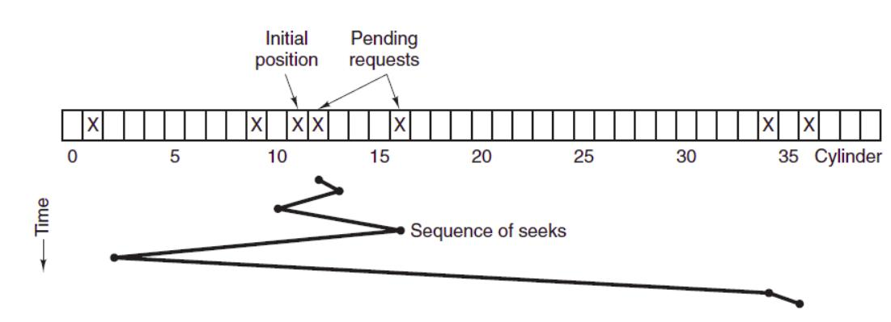

[toc]

## I/O

### 1. 分类

- **块设备**：信息存储在固定的块中，每个块都能独立读写，例如硬盘
- **字符设备**：以字符为单位接收或发生一个字节流，不可寻址，例如打印机、鼠标

### 2.　编址方式

- **独立编址**：外设的控制寄存器被分配单独的 I/O 端口号
- **内存映射**：分配唯一的内存地址

### ３. 磁盘

#### 3.1 磁盘结构

- 盘面（Platter）：一个磁盘有多个盘面；
- 磁道（Track）：盘面上的圆形带状区域，一个盘面可以有多个磁道；
- 扇区（Track Sector）：磁道上的一个弧段，一个磁道可以有多个扇区，它是最小的物理储存单位，目前主要有 512 bytes 与 4 K 两种大小；
- 磁头（Head）：与盘面非常接近，能够将盘面上的磁场转换为电信号（读），或者将电信号转换为盘面的磁场（写）；
- 制动手臂（Actuator arm）：用于在磁道之间移动磁头；
- 主轴（Spindle）：使整个盘面转动。

#### 3.2 磁盘臂调度算法

对于磁盘而言，主导访问速度的是**寻道时间**

主要算法：

- **先来先服务 FCFS**：按照磁盘请求的顺序进行调度
- **最短寻道时间优先 SSTF**：优先调度与当前磁头最近的磁道
- **电梯算法 SCAN**：总是按一个方向来进行磁盘调度，直到该方向上没有未完成的磁盘请求，然后改变方向

