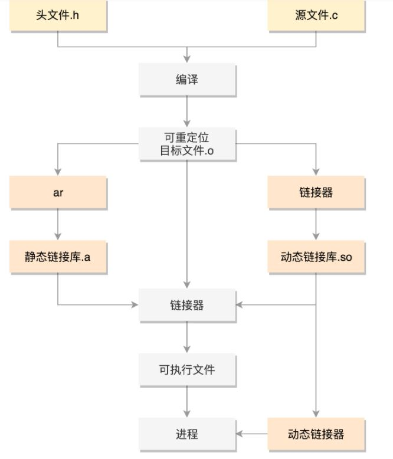
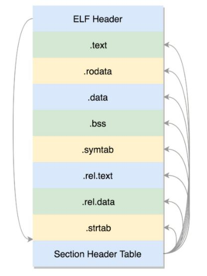
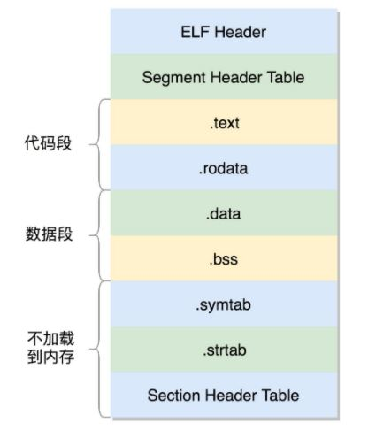
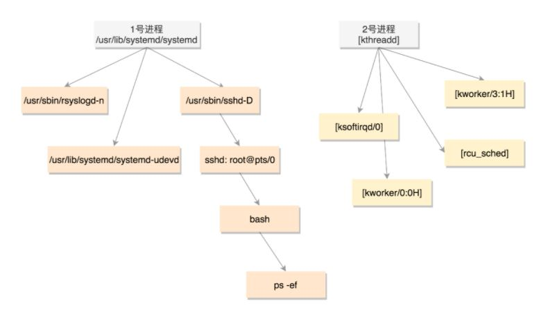
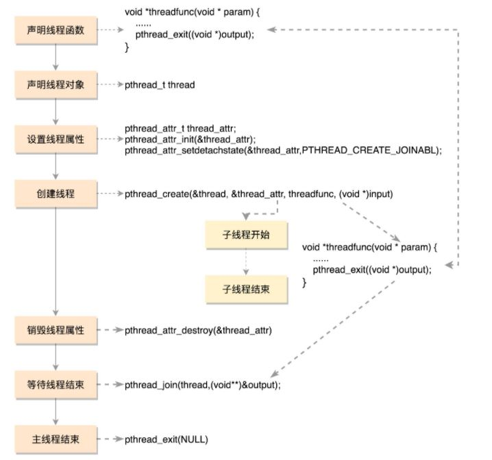

## Linux 进程管理实现

### 1. 程序的二进制格式

代码到进程的演变过程

Linux 的二进制程序格式为 **ELF**，可分为

- 可重定位文件：中间文件，链接之后形成可执行文件

  

  文件格式

  - .text：放编译好的二进制可执行代码
  - .data：已经初始化好的全局变量
  - .rodata：只读数据，例如字符串常量、const 的变量
  - .bss：未初始化全局变量，运行时会置 0
  - .symtab：符号表，记录的则是函数和变量
  - .strtab：字符串表、字符串常量和变量名

- 可执行文件：可执行文件中的各个段由多个可重定位文件链接而来，载入内存后即可运行

  

- 共享对象文件/动态链接库：静态库代码段被多个程序使用将在内存中产生多个副本，动态链接库通过 **在内存中保存库的引用** 解决该问题

### 2. 进程与线程概述

#### 2.1 进程树

用户态进程的顶级父进程为 **systemd** 进程，内核态进程的顶级父进程为 **kthreadd** 进程

#### 2.2 线程

线程数据类型：

- 本地数据：存放在线程独立的栈中，例如局部变量
- 全局数据：线程共享，例如进程中的全局变量
- 线程私有数据：采用一键多值的形式，各个线程通过相同的 key 得到不同的 value