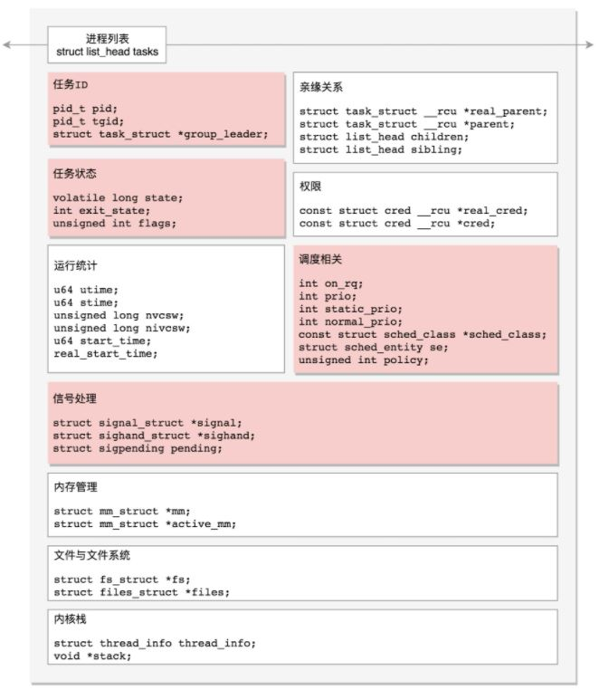
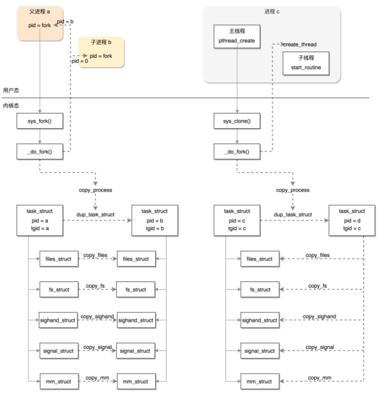

## Linux 进程管理实现

### 1. 程序的二进制格式

代码到进程的演变过程


Linux 的二进制程序格式为 **ELF**，可分为

- 可重定位文件：中间文件，链接之后形成可执行文件

  

  文件格式

  - .text：放编译好的二进制可执行代码
  - .data：已经初始化好的全局变量
  - .rodata：只读数据，例如字符串常量、const 的变量
  - .bss：未初始化全局变量，运行时会置 0
  - .symtab：符号表，记录的则是函数和变量
  - .strtab：字符串表、字符串常量和变量名

- 可执行文件：可执行文件中的各个段由多个可重定位文件链接而来，载入内存后即可运行

  

- 共享对象文件/动态链接库：静态库代码段被多个程序使用将在内存中产生多个副本，动态链接库通过 **在内存中保存库的引用** 解决该问题


### 2. 进程与线程概述

#### 2.1 进程

**进程状态**：

- TASK_RUNNING：进程在 CPU 上执行或准备执行
- TASK_INTERRUPTIBLE：可中断的等待状态，当等待的资源被释放或者收到一个信号，可唤醒该进程
- TASK_UNINTERRUPTIBLE：不可中断的等待状态，只能等待资源释放，不可被信号唤醒，包括KILL 信号
- TASK_KILLABLE：可以终止的新等待状态，类似 TASK_UNINTERRUPTIBLE，但可被 KILL 唤醒
- TASK_STOPPED：接收到 SIGSTOP、SIGTSTP、SIGTTIN、SIGTTOU 信号进入该状态
- TASK_TRACED：被 debugger 等进程监视会进入该状态

用户态进程的顶级父进程为 **systemd** 进程，内核态进程的顶级父进程为 **kthreadd** 进程


#### 2.2 线程


线程数据类型：

- 本地数据：存放在线程独立的栈中，例如局部变量
- 全局数据：线程共享，例如进程中的全局变量
- 线程私有数据：采用一键多值的形式，各个线程通过相同的 key 得到不同的 value


### 3. 进程数据结构

Linux 进程与线程都使用 **task_struct** 统一维护

``` c
struct tast_struct {
    /* id相关部分，如果只有一个主线程，则pid = tgid, group_leader为该主线程 */
    pid_t pid; // 进程id
    pid_t tgid; // 线程组id
    struct task_struct *group_leader;
    /* 任务状态 */
    volatile long state;    /* -1 unrunnable, 0 runnable, >0 stopped */
    int exit_state;
    unsigned int flags;
    /* 调度相关 */
    int	on_rq; // 是否在运行队列上
    // 优先级 
    int prio; // 动态优先级
    int	static_prio; // 静态优先级
    int	normal_prio;
    unsigned int rt_priority; // 实时优先级
    // 调度实体
    struct sched_entity	se;
    struct sched_rt_entity rt;
    struct sched_dl_entity dl;
    unsigned int policy; // 调度策略
    /* 亲缘关系 */
    struct task_struct __rcu *real_parent; /* real parent process */
    struct task_struct __rcu *parent; // 当前父进程，通过与real_parent相同
                                      // 终止时须向父进程发送信号
    struct list_head children; // 子进程链表头部
    struct list_head sibling;  // 兄弟进程链表的下一个元素
    /* 用户态与内核态相关 */
    struct thread_info	thread_info; // 保存了task_struct的节点，
                                     // 如果这个进程正在运行，可用于查找该进程的相关信息
    void  *stack; // 内核栈
    ... 
}
```

``` c
struct thread_info {
	struct task_struct	*task;		/* main task structure */
	__u32			flags;		/* low level flags */
	__u32			status;		/* thread synchronous flags */
	__u32			cpu;		/* current CPU */
	mm_segment_t		addr_limit;
	unsigned int		sig_on_uaccess_error:1;
	unsigned int		uaccess_err:1;	/* uaccess failed */
};
```

内核栈结构如下，pt_regs 即为进入内核态时保存的寄存器信息





### 4. 进程调度

Linux的进程是抢占式的，并通过 **时间分片** 运行

进程分类：

- 实时进程：实时优先级在 0 - 99，数值越小，优先级越高
- 普通进程：静态/动态优先级在 100 - 139，静态优先级越小，分配的时间片越大

**完全公平调度算法 CFS** ：

- 每一个进程都有一个虚拟运行时间 vruntime，进程运行时 vruntime 不断增大，vruntime 与进程实际运行时间相关，但需要再权重(权重与进程的优先级成正比)，所以优先级高的进程 vruntime 会增加的更慢，每次选择 vruntime 最小的进程运行。

- CFS 队列采用**红黑树**实现，因为 vruntime 一直改变，一经改变就需要排序

- 红黑树存储在 struct rq 结构中，每个 CPU 都有自己的 rq，一个实时进程队列 rt_rq 和一个 CFS 运行队列 cfs_rq，优先在 rt_rq 中进行调度


### 5. 创建

#### 5.1 进程创建

Linux 中进程的创建通过系统调用 fork 实现，fork 调用相应的 _do_fork

``` c
SYSCALL_DEFINE0(fork)
{
......
	return _do_fork(SIGCHLD, 0, 0, NULL, NULL, 0);
}

long _do_fork(unsigned long clone_flags,
	      unsigned long stack_start,
	      unsigned long stack_size,
	      int __user *parent_tidptr,
	      int __user *child_tidptr,
	      unsigned long tls)
{
	struct task_struct *p;
	int trace = 0;
	long nr;
 
 
......
    /**
     * copy_process主要进行下述工作:
     * 1. 分配task_struct结构，创建内核栈，设置thread_info
     * 2. 复制父进程的权限
     * 3. 设置调度相关。设置状态为TASK_NEW，初始化优先级、调度类
     * 4. 处理文件系统相关。复制父进程打开的文件信息
     * 5. 处理信号相关
     * 6. 复制进程内存空间
     * 7. 初始化pid、tid、group_leader，建立进程亲缘关系
     */
	p = copy_process(clone_flags, stack_start, stack_size,
			 child_tidptr, NULL, trace, tls, NUMA_NO_NODE);
......
	if (!IS_ERR(p)) {
......
        /**
         * wake_up_new_task唤醒新进程，主要工作：
         * 1. 设置状态为TASK_RUNNING，将该任务插入调度队列
         * 2. 尝试抢占CPU
         */
		wake_up_new_task(p);
......
		put_pid(pid);
	} 
```

#### 5.2 线程创建

线程创建通过 pthread_create 实现，该函数是 Glibc 的一个函数，而不是系统调用

该函数的主要工作：

- 用户态：
  - 设置线程属性，创建用户态线程结构 pthread
  - 创建线程栈
- 内核态：
  - 设置调度策略
  - 通过 create_thread 创建线程，调用 _do_fork，与进程创建不同的是，线程不再创建一系列结构，而是直接使用该进程的资源

**总结**

