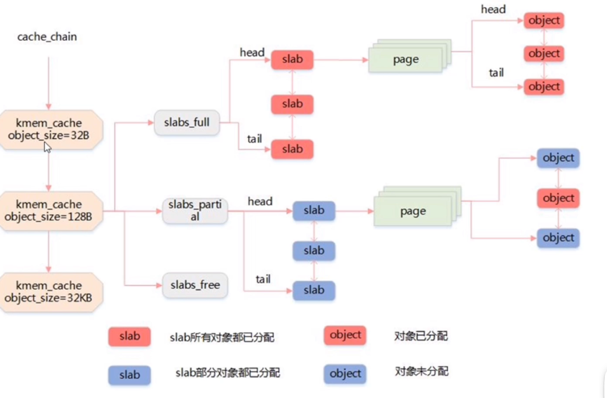
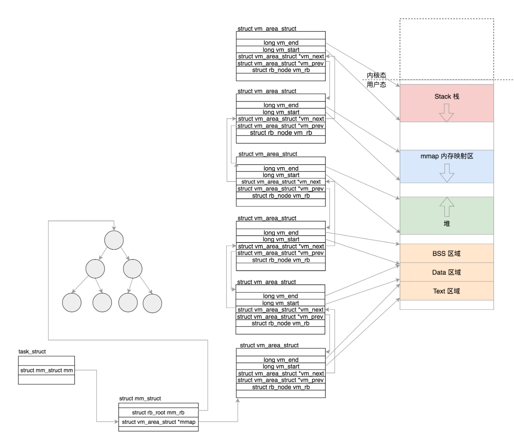

## 内存管理

### 1. 介绍

内存管理的主要工作：

- 虚拟内存空间的管理
- 物理内存的管理
- 虚拟内存到物理内存的映射

用户空间和内核空间都使用虚拟内存，但访问空间只能在各自的范围

### 2. 物理内存管理

#### 2.1 页

Linux 内核将物理页作为内存管理的基本单位，页按映射类型分为

- 匿名页：和虚拟地址空间直接建立映射
- 内存映射文件：关联一个文件，再与虚拟地址空间建立映射

``` c
// 该结构体表示一个物理页
struct page {
    unsigned long         flags; // 该页的状态
    atomic_t              _count; // 引用计数，-1为无引用
    atomic_t              _mapcount;
    unsigned long         private;
    struct address_space  *mapping; // 用于映射，匿名页最低位为1，否则为0
    pgoff_t               index; // 在映射区的偏移量
    struct list_head      lru; // LRU链表
    void                  *virtual; // 虚拟地址
}
```

#### 2.2 区

内存中某些特定物理位置的页不能用于特定任务，故内核堆页进行分区，用区对具有相似特性的页进行分组，分区类型：

- ZONE_DMA： 该区的页能用于 DMA
- ZONE_DMA32：与 ZONE_DMA 相似，但只能被 32 位设备访问
- ZONE_NORMAL： 从物理内存到虚拟内存的内核区域，通过加上一个常量直接映
- ZONE_HIGHMEM： 高端内存区，对于 32 位系统来说超过 896M 的地方，对于 64 位没必要有的一段区域。
- ZONE_MOVABLE： 可移动区域，通过将物理内存划分为可移动分配区域和不可移动分配区域来避免内存碎片。

#### 2.3 物理内存分配

##### 2.3.1 页分配

 `alloc_pages` 分配多个连续物理页的分配，基于 <a href="../内存管理.md">伙伴系统</a> 实现，分配 2^order 个连续物理页。

以找 256 个页大小的块为例，算法流程：

- 在 256 页的链表检查是否有空闲块，如果存在则之间分配，不存在进行下述操作
- 在 512 页的链表检查是否有空闲块，如果存在则平分为为两份，一份用于分配内存，另一份插入到 256 页的链表中；不存在继续在 1024 页的链表搜索
- 如果遍历所有链表都未找到空闲块，则发出错误信号

``` c
/** 
 * gfp_mask说明分配内存的区域
 */
static inline struct page *alloc_pages(gfp_t gfp_mask, unsigned int order)
{
	return alloc_pages_current(gfp_mask, order);
}
```

##### 2.3.2 slab

slab 用于实现 **固定大小的内存** 分配，slab 层将不同对象划分为高速缓存 (cache) 组，高速缓存内存放的对象大小相同。

每个高速缓存由多个 slab 组成，每个 slab 由一个或者多个 **物理上连续** 的页组成。




### 3. 虚拟内存管理

#### 3.1 虚拟内存组织

虚拟内存区域 VMA 布局：

- Text Segment：存放二进制可执行代码
- Data Segment：存放静态常量
- BSS Segment：存放未初始化的静态变量
- 堆：往高地址增长
- Memory Mapping Segment：将文件映射进内存
- 栈：往低地址增长
- ...

一个进程的虚拟空间用 `mm_struct` 描述，用 `vm_area_struct` 来描述一个 VMA，进程的虚拟地址空间由多个 VMA 组成。

线程之间的内存共享就是通过指向同一个 `mm_struct` 实现的。

``` c
struct mm_struct {
    // 虚拟内存相关
    unsigned long mmap_base; // 虚拟地址空间用于内存映射的起始地址
    unsigned long total_vm;	// 映射页的总数目
    unsigned long locked_vm; // 不能换出的页的数目
    unsigned long pinned_vm; // 不能换出、移动的页的数目
    unsigned long data_vm; // 存放数据的页的数目
    unsigned long exec_vm; // 存放可执行文件的页的数目
    unsigned long stack_vm; 
    unsigned long start_code, end_code, start_data, end_data; // 数据、可执行文件的起始、终止位置
    unsigned long start_brk, brk, start_stack; // 堆起始位置、堆结束位置、栈起始位置
    struct vm_area_struct *mmap;		/* list of VMAs */
	struct rb_root mm_rb; // 红黑树，用于查找一个VMA区域
    
    // 物理内存相关
    pgd_t *pgd; // 指向该进程的页目录表，通过页表映射定位物理地址
    ...
}
```

``` c
struct vm_area_struct {
    struct mm_struct *vm_mm; // 指向虚拟空间
	unsigned long vm_start;	// VMA在虚拟空间的起始地址
	unsigned long vm_end; // VMA在虚拟空间的结束地址
	struct vm_area_struct *vm_next, *vm_prev; // 指向下/上一个VMA
	const struct vm_operations_struct *vm_ops; // 在该区域进行操作的函数
    ... 
} 
```



#### 3.2 虚拟内存到物理内存

linux 使用多级页表存储，在 `mm_struct` 存储了该进程的页表目录，CPU 的 CR3 寄存器存储最上级页表的 **起始物理地址** ，在内存映射时将页表目录地址传到 CR3。

多级页表的地址转换（以 2 级页表，32位处理器，页为 4k 举例）：

- 通过 CR3 寄存器找到一级页表的起始物理地址
- 根据当前虚拟地址的 高 10 位 作为偏移找到一级页表物理地址
- 根据当前虚拟地址的 中间 10 位 作为偏移找到页物理地址
- 根据当前虚拟地址的低 12 位作为偏移量与页物理地址结合找到真实的物理地址

以上操作由 MMU 自动完成