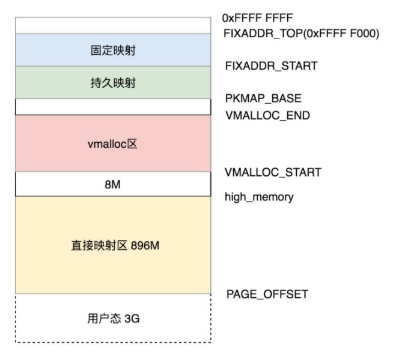

## 内存管理

### 1. 介绍

内存管理的主要工作：

- 虚拟内存空间的管理
- 物理内存的管理
- 虚拟内存到物理内存的映射

用户空间和内核空间都使用虚拟内存，但访问空间只能在各自的范围

### 2. 内存布局

#### 2.1 用户空间布局

用户空间从低到高的布局：

- Text Segment：存放二进制可执行代码
- Data Segment：存放静态常量
- BSS Segment：存放未初始化的静态变量
- 堆：往高地址增长
- Memory Mapping Segment：将文件映射进内存
- 栈：往低地址增长

``` c
struct mm_struct {
    unsigned long mmap_base; // 虚拟地址空间用于内存映射的起始地址
    unsigned long total_vm;	// 映射页的总数目
    unsigned long locked_vm; // 不能换出的页的数目
    unsigned long pinned_vm; // 不能换出、移动的页的数目
    unsigned long data_vm; // 存放数据的页的数目
    unsigned long exec_vm; // 存放可执行文件的页的数目
    unsigned long stack_vm; 
    // 数据、可执行文件的起始、终止位置
    unsigned long start_code, end_code, start_data, end_data;
    // 堆起始位置、堆结束位置、栈起始位置
    unsigned long start_brk, brk, start_stack;
    // 参数、环境位置
    unsigned long arg_start, arg_end, env_start, env_end;
    ...
}
```

#### 2.2 内核态布局



### 3. 物理内存管理

#### 3.1 页

Linux 内核将物理页作为内存管理的基本单位，页按映射类型分为

- 匿名页：和虚拟地址空间直接建立映射
- 内存映射文件：关联一个文件，再与虚拟地址空间建立映射

内核使用下列数据结构表示每个物理页

``` c
struct page {
    unsigned long         flags; // 该页的状态
    atomic_t              _count; // 引用计数，-1为无引用
    atomic_t              _mapcount;
    unsigned long         private;
    struct address_space  *mapping; // 用于映射，匿名页最低位为1，否则为0
    pgoff_t               index; // 在映射区的偏移量
    struct list_head      lru; // LRU链表
    void                  *virtual; // 虚拟地址
}
```

#### 3.2 区

内存中某些特定物理位置的页不能用于特定任务，故内核堆页进行分区，用区对具有相似特性的页进行分组，分区类型：

- ZONE_DMA： 该区的页能用于 DMA
- ZONE_DMA32：与 ZONE_DMA 相似，但只能被 32 位设备访问
- ZONE_NORMAL： 从物理内存到虚拟内存的内核区域，通过加上一个常量直接映
- ZONE_HIGHMEM： 高端内存区，对于 32 位系统来说超过 896M 的地方，对于 64 位没必要有的一段区域。
- ZONE_MOVABLE： 可移动区域，通过将物理内存划分为可移动分配区域和不可移动分配区域来避免内存碎片。

#### 3.3 页的分配

页分配的核心函数是 alloc_pages，该方法能分配 2^order 个连续物理页，并返回第一页的 page 结构体指针

``` c
/** 
 * gfp_mask说明分配内存的区域
 * GFP_USER:用户进程的虚拟地址空间
 * GFP_KENERL: 在内核中分配页
 * GFP_HIGHMEM: 在高端内存区分配页
 */
static inline struct page *alloc_pages(gfp_t gfp_mask, unsigned int order)
{
	return alloc_pages_current(gfp_mask, order);
}
```


