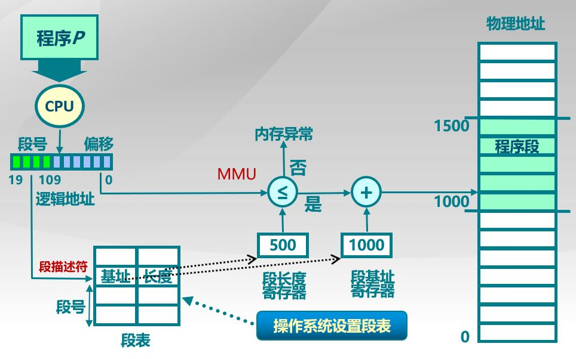

[toc]

## 内存管理

内存管理的主要工作，**负责内存的分配与回收**，进行**地址转换**(逻辑地址转换为物理地址)

### 1. 连续内存分配

#### 1.1 分配策略

连续内存的分配策略：

- 最先匹配：选择第一个可用的空闲内存进行分配，实现简单，高地址有大块的空闲分区；但内存碎片多，分配大内存时搜索时间长
- 最佳匹配：选择最合适大小的空闲内存，内存碎片少，但速度较慢
- 最差匹配：选择最大的空闲内存，大内存分配多时效果好，小内存分配容易破坏大的空闲分区

#### 1.2 伙伴系统

伙伴系统的内存分配策略：

- 可分配的分区大小为 2^u，当需要的分区大小位于 (2^(u-1), 2^u] 时，将整块分配给该进程
- 需要的分区大小不在该区间时，将分区划分为两个等大的空闲分区，直到位于该区间

### 2. 非连续内存分配

#### 2.1 分段

分段则将内存分为一个个段，各段的长度可以不同，可以动态增长，并给予逻辑意义：主程序段、子程序段、数据段、栈段等等，通过段表进行转换

#### 2.2 分页

##### 2.2.1 分页

将逻辑地址和物理地址空间划分为基本分配单元，页。

每一页是连续的，页间不要求连续，这些页被映射到物理内存

分页需要访问两次内存(第一次为页表)才能得到数据，并且如果使用单级页表将导致占据内存过大，故引入 TLB 和 多级页表

##### 2.2.2 TLB 和多级页表

**快表 TLB**

快表是为了**加快地址转换的速度**，快表是 CPU 中的寄存器，采用缓存机制

使用快表后的地址转换流程：

- 根据虚拟地址的页号查询快表
- 在快表中，则直接读取物理地址
- 不在快表中，则访问页表得到物理地址，并在快表中进行添加
- 快表满了之后按照淘汰策略淘汰一个页

**多级页表**

目的是解决单级页表所占内存过多的问题，将页表分为多级，多次查询

在内存中存放上级页表即可 (类似书的标题)，CPU 的 CR3 寄存器存储最上级页表的起始地址

##### 2.2.3 分段与分页的比较

- 对程序员的透明性：分页透明，但是分段需要程序员显式划分每个段
- 地址空间的维度：分页是一维地址空间，分段是二维的
- 大小是否可以改变：页的大小不可变，段的大小可以动态改变
- 出现的原因：分页主要用于实现虚拟内存，从而获得更大的地址空间；分段主要是为了使程序和数据可以被划分为逻辑上独立的地址空间并且有助于共享和保护

#### 2.3 段页式管理

将内存先分成若干段，每个段分成若干页

### 3. 虚拟内存

**目的**：程序大于主存，使用虚拟内存技术将物理内存**扩充**为更大的逻辑内存；对进程之间进行内存隔离，保证**安全性**

**基本思想**：装载程序时将需要的部分页装入内存，当需要的指令或者数据不在内存时，**触发缺页中断**，将不常用的部分内存换到外存( Linux 的交换分区)

### 4. 页面置换算法

主要目标：使页面置换次数最少，即缺页率最低

- **最佳置换算法 OPT**：Optimal，选择最长时间不再被访问的页换成，理论算法，无法实现

- **最少使用LFU**：Least Frequently Used，选择在之前时期使用最少的页面作为淘汰页

- **最近最久未使用 LRU**：Last Recently Used，选择最近最久未使用的页面换出，维护一个链表，当页面被访问时将其移到表头，需要置换时将表尾页面换出

- **最近未使用 NRU**：Not Recently Used，设置两个状态位 R 和 M，页面被访问时 R 置为 1，页面被修改时 M 置为 1， R 会定期清 0，优先置换 R = 0，M = 0 和 R = 0， M = 1的页面(随机选择)

- **FIFO**：将最先进入的页面换出

- **第二次机会算法**：对 FIFO 的完善，页面被访问时置 R = 1。需要置换时检查 R，如果 R 为 0 ，表明是未访问的老页面， 进行置换；如果 R 为 1，将 R 清 0，并将该页面当作新页面对待

- **时钟算法 Clock**：将第二次机会算法的链表改为环型链表，并使用一个指针指向最老页面

  

