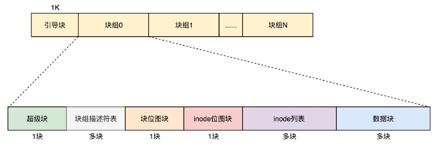

[toc]

## 文件系统

### 1. 文件系统概述

文件描述符是打开的文件在内存所维护的信息，包含以下部分：

- 文件指针：最近一次读写位置，进程独立
- 文件打开计数：当为 0 时可以从内存删除
- 文件的磁盘位置
- 访问权限

数据块是逻辑存储单元，扇区是物理存储单元。进程读写数据均需要**按块读取**，先读入整块数据块

### 2. Linux 文件管理实现

Linux 的文件管理系统格式如下

- **引导块**：装载操作系统
- **超级块**：包含文件系统的所有参数，块大小，空余块等待
- **i 节点**：index-node，i 节点记录了文件属性和文件块的磁盘地址，当文件被打开时，相应的 i 节点读入内存

Linux 的文件缓存：基于 LRU 实现，主要有如下两个数据结构

- 哈希表：通过哈希指针链到相应的链表节点
- 链表：用以实现 LRU 

