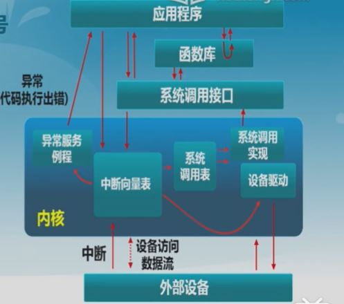

[toc]

## 概述

### 1. 操作系统定义

操作系统是运行在计算机上的软件程序，管理计算机硬件与软件资源，并给用户提供了与硬件交互的桥梁

### 2. 系统调用

#### 2.1 系统调用

进程在系统上的运行分为用户态和内核态，为了保证安全性，用户态不能访问内核态，内核态可以访问任意资源，内核态和用户态根据 CPU 的 CPL 区分。

当进程需要完成内核态的操作时，通过 **系统调用** 陷入内核( X86 架构下使用中断或 SYSENTER 指令实现)，由操作系统代为完成。

**过程**：用户态 - 系统调用 - 保存寄存器 - 内核态 - 恢复寄存器 - 用户态

- 用户代码有一段包含中断的代码(库函数)；
- 操作系统获取对应编号；
- 根据编号找到相应的中断处理程序

#### 2.2 中断、异常和系统调用

- 中断：来自硬件设备的处理请求，异步响应
- 异常：非法指令或其他原因导致当前指令执行失败，同步响应
- 系统调用：应用程序 **主动** 向操作系统发出的请求，同步或者异步响应

#### 2.3 系统调用的开销

- 引导至相应实现

- 建立内核堆栈
- 内核态映射到用户态的地址空间
- 内核态独立地址空间，更新 TLB

### 3. 系统启动

系统启动流程

- BIOS ROM 读取加载程序到内存，通过 CS:IP 跳转到相应起始位置执行
- 加载程序读取操作系统，并跳转到操作系统起始位置
- 初始化