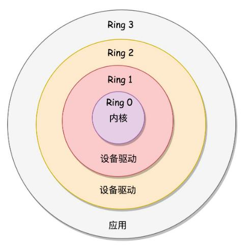

[toc]

## 概述

### 1. 操作系统定义

操作系统是运行在计算机上的软件程序，管理计算机硬件与软件资源，并给用户提供了与硬件交互的桥梁

### 2. 系统调用

进程在系统上的运行分为用户态和内核态，为了保证安全性，用户态的资源访问受限，当进程需要完成内核态的操作时，通过**系统调用**陷入内核( X86 架构下计算使用中断实现)，由操作系统代为完成

**过程**：用户态 - 系统调用 - 保存寄存器 - 内核态 - 恢复寄存器 - 用户态