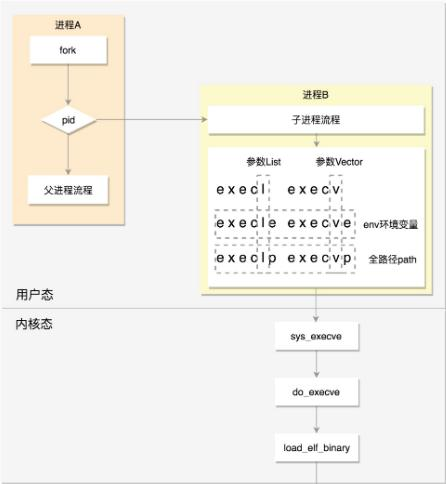

[toc]

## 进程管理

### 1. 进程

#### 1.1 定义

一个进程就是一个正在执行程序的实例，包括程序计数器、寄存器和变量值等，是资源分配的基本单位

#### 1.2 创建进程

在 Linux 中，通过 fork 创建一个和调用进程相同的副本，子进程执行 execve 修改其存储映象，运行新的程序，并与父进程组成一个进程组

Linux 中 1 号进程是用户态祖先进程，2 号进程是内核态线程运行的祖先

#### 1.3 进程状态

进程分为以下状态：

- **创建状态** (new)：进程正在被创建
- **就绪状态** (ready)：已获得 CPU 之外的资源，得到 CPU 资源即可运行
- **运行状态** (running) ：占用 CPU
- **阻塞状态** (waiting)：又称等待状态，等待某种外部事件发生(资源或者 IO )，即使得到 CPU 资源也无法运行
-  **结束状态** (terminated)：进程正在销毁

Linux 下可以 使用 cat /proc/pid/* 来查看相应 pid 进程的信息

### 2. 线程

线程是操作系统**独立调度**的基本单位，**共享进程资源**，比进程更轻量级

低版本的 Linux 通过**轻量级进程**来实现线程

### 3. 进程同步

#### 3.1 临界区

临界区： 对共享进行访问的程序片段

进程进入临界区前，先检查是否允许进入，进行互斥访问

#### 3.2 信号量

信号量用以表示累计唤醒此书，取值为非负整数，支持 up( V ) 和 down ( P ) 操作

- down：信号量大于 0，则 - 1；信号量等于 0，进程睡眠
- up：进行 +1 操作，唤醒睡眠的进程

当信号量取值只有 0 或 1 时，便成为了 **互斥量**

#### 3.3 管程

管程将控制代码进行独立，进程可随时调用管程，并且只能通过管程访问管程内部的数据，**任一时刻管程只有一个活跃进程**

管程引入了 **条件变量** 以及相关的操作：**wait()** 和 **signal()** 来实现同步操作。对条件变量执行 wait() 操作会导致调用进程阻塞，把管程让出来给另一个进程持有。signal() 操作用于唤醒被阻塞的进程

#### 3.4 屏障

屏障用于**进程组**而不是双进程的生产者-消费者类情形，在应用中划分若干阶段，并在阶段尾插入屏障，当一个进程到达屏障时，将被屏障阻拦，直到 **所有进程到达该屏障**

### 4. 进程调度

不同的环境需要不同的调度算法，现考虑批处理、交互式、实时三种环境

#### 4.1 批处理

批处理系统用户操作少，优先保证吞吐量和周转时间 (提交到终止的时间)

- **FCFS**：先来先服务，first-come-first-severd。非抢占式，按照请求顺序执行
- **最短作业优先**：非抢占式，优先选择作业时间短的进程，但是将导致长作业时间的进程饥饿
- **最短剩余时间优先**：抢占式，选择剩余运行时间最短的进程运行

#### 4.2 交互式

交互式系统最重要的指标是 **最小响应时间**

- **时间片轮转**：在 FCFS 的基础上，设置时间片，每个进程运行时间片的时间之后，进行进程切换；时间片设置太短将导致过多进程切换，CPU 利用率低，设置太长响应时间变长
- **优先级调度**：为每个进程分配一个优先级，按优先级进行调度。为了防止低优先级的进程永远等不到调度，随着时间的推移增加等待进程的优先级。
- **多级反馈队列调度**：设置了多个队列，每个队列时间片大小都不同，例如 1,2,4,8,..。进程在第一个队列没执行完，就会被移到下一个队列。队列优先级自上而下逐渐降低，仅当上面的队列没有进程排队时才能调度当前队列的进程

#### 4.3 实时

实时系统要求在一个确定时间内就能得到响应，分为硬实时与软实时

- 硬实时：必须满足绝对的截止时间
- 软实时：可以容忍一定超时

#### 4.4 Linux 的 进程调度

Linux 在 task_struct 中通过 policy 变量设置调度策略，取值有

针对实时调度

- SCHED_FIFO：即 FCFS 先来先服务
- SCHED_RR：时间片轮转调度
- SCHED_DEADLINE：产生调度点时，选择 deadline 距离当前时间最近的任务

针对普通调度

- SCHED_NORMAL：普通进程
- SCHED_BATCH：后台进程，可以降低优先级
- SCHED_IDLE：空闲时才运行的进程

Linux 的**完全公平调度算法 CFS** ：

每一个进程都有一个虚拟运行时间 vruntime，进程运行时 vruntime 不断增大，vruntime 与进程实际运行时间相关，但需要再权重(权重与进程的优先级成正比)，所以优先级高的进程 vruntime 会增加的更慢，每次选择 vruntime 最小的进程运行。对 vruntime 的存储 Linux 采用红黑树实现，因为 vruntime 一直改变，一经改变就需要排序

### 5. 进程通信 IPC

进程同步与进程通信的区别

- 进程同步：控制多个进程按一定顺序执行；
- 进程通信：进程间传输信息

常见进程通信方式

- **匿名管道**：父子进程或者兄弟进程的通信，半双工通信

- **有名管道**：遵循 FIFO，以磁盘文件形式支持任意两个进程通信；Linux 中管道本质上就是内核中的一串缓存

- **信号**：通知接收进程某个事件已经发生

- **消息队列**：与管道不同的是，消息队列存放于**内核**中，内核重启或者显式删除才真正删除

- **信号量**：是一个计数器，用于多进程对共享数据的访问，实现进程间同步

- **共享内存**：多个进程可以访问同一块内存空间，不同进程可以及时看到对方进程中对共享内存中数据的更新。这种方式需要互斥锁和信号量等同步操作

- **socket**：套接字，用于在客户端和服务器之间通过网络进行通信，可用于不同主机的进程通信

  ****