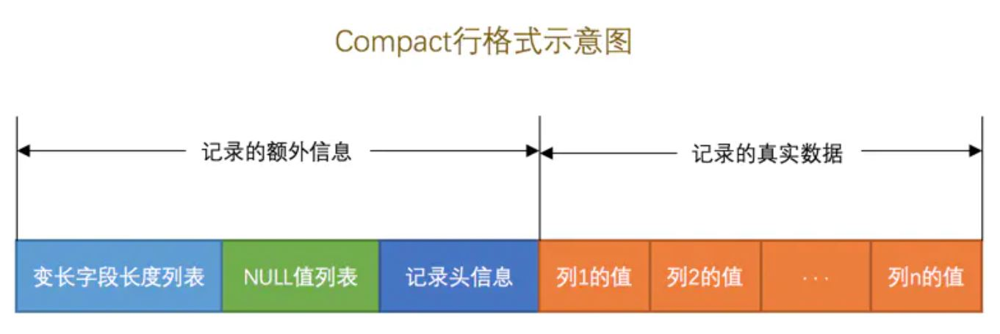
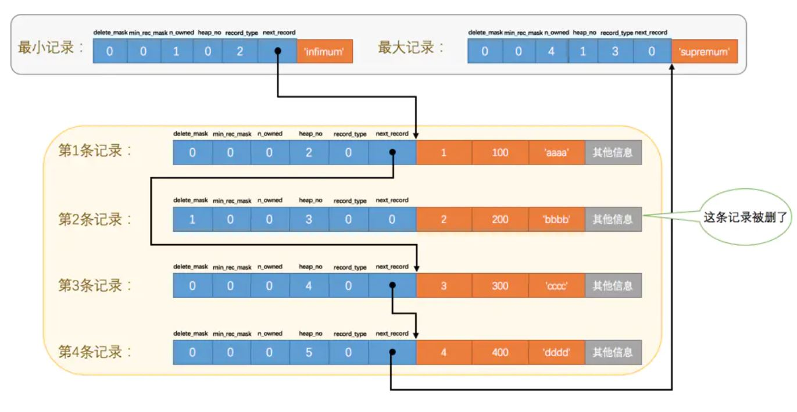
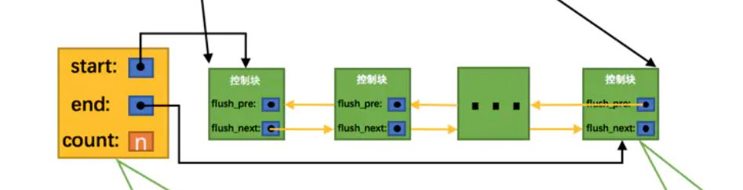
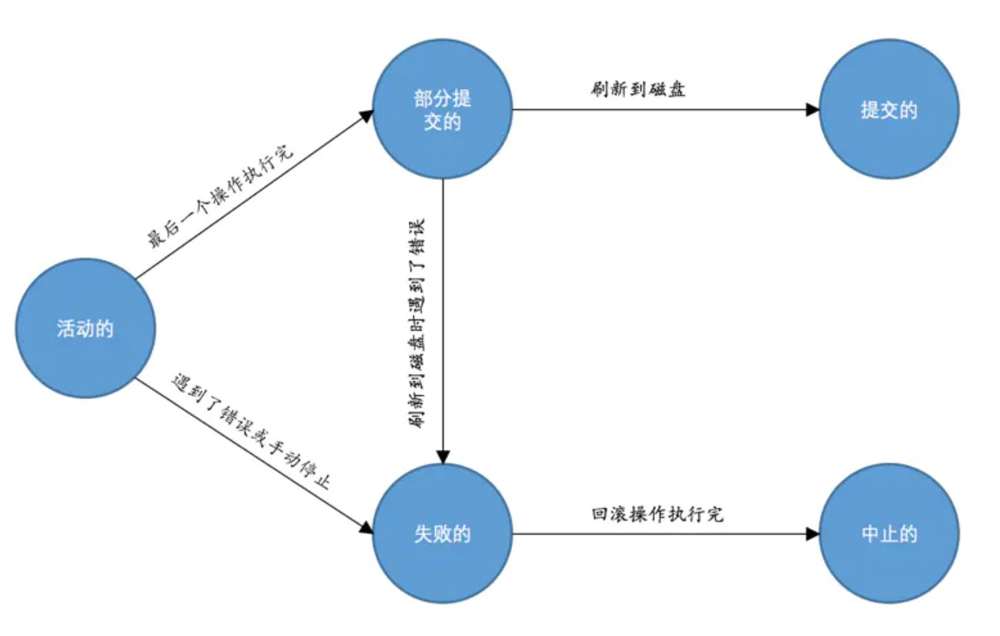
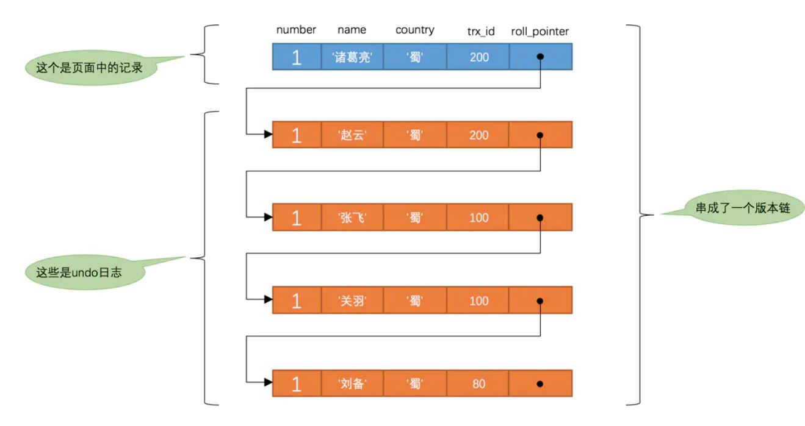

[toc]

## InnoDB存储引擎

### 1. InnoDB 介绍

InnoDB 是默认的存储引擎，以 **页** 作为磁盘和内存交互的基本单位，一次至少读写一个页，默认页大小为 16 KB。

体系结构：

- 后台线程
  - `master thread` 负责同步数据、合并插入缓冲等工作
  - `IO thread` 采用 AIO 的方式处理 IO 请求
  - `purge thrad` 回收 undo 页
  - `page cleaner thread` 刷新脏页
- 内存
  - Buffer Pool，见第 6 节
  - redo log buffer，见 8.1 节


关键特性：

- insert buffer：对于非唯一（UNIQUE）二级索引的插入和更新，采用 `insert buffer` 存储，之后再与聚簇索引页合并
- double write：刷新脏页时，先复制到 `doublewrite buffer`，再分两次写到磁盘上；写入崩溃时可以从 `doublewrite buffer` 获取副本进行恢复
- 自适应哈希索引：为热点页创建哈希索引，提高查询速度
- AIO
- 刷新邻接页：刷新脏页时，检测页所在 `区` 的所有页，如果是脏页则一同刷新


### 2.行格式

InnoDB 具有 4 种行格式，分别是 `Compact`、`Redundant`、`Dynamic` 和`Compressed`

#### 2.1 Compact

`Compact` 的行格式如下图所示



##### 2.1.1 额外信息

- 变长字段长度：按照列的顺序 **逆序** 存储带变成字段的列实际占用的字节数
- NULL 值列表：使用位图逆序存储各列是否为 NULL
- 记录头信息：记录该行的相关信息

##### 2.1.2 真实数据

真实数据部分存储实际数据，并含有三个隐藏列

- `row_id` ：行 id，非必需，如果未自定义主键，则默认生成 `row_id` 作为隐藏主键
- `trx_id`：事务 id，MySQL 生成，实现事务
- `roll_pointer` ：回滚指针，MySQL 生成，实现事务回滚 

行溢出：当某一列的数据特别多时，在 `真实数据` 部分只存储一部分数据，把剩余的数据存储在其他页中（存储这些数据的页面称为 `溢出页` ），用一定数量字节存储这些页的地址。

#### 2.2 Dynamic

`Dynamic` 是 InnoDB 默认的行格式，基本与 `Compact` 相同，但在处理行溢出上不存储部分数据，而是将所有数据都存储在溢出页。

 

#### 2.3 Compressed

`Compressed` 会采用压缩算法对页面进行压缩，以节省空间，其余与 `Dynamic`相似。

#### 2.4 Redundant

`Redundant` 是 5.0 版本前的默认格式，不多介绍。


### 3. 数据页结构

InnoDB 的数据页结构如下图所示


页默认大小为 16 KB，分为 7 个部分：

- File Header：文件头，记录页的通用信息，保存了上一个页和下一个页的页编号，形成页链表（B+ 树的叶节点）

- Page Header：表示页的专有信息

- Infimum + Supremum：页中数据形成链表，Infimum、Supremum 分别是链表的头、尾哨兵节点

- User Records：存储数据行，插入新数据则从 Free Space 中分配空间；行的记录头信息中包含 `next_record` 将各数据行组成链表，`delete_mask` 记录该行是否被删除（采用懒删除，如果插入新数据可能复用该行），下图为 User Records 数据存储示意

  

- Free Space：页中未使用的部分

- Page Directory：页中 `槽` 的相对位置，InnoDB 会把页中的记录划分为若干个组，每个组的最后一个记录的地址偏移量作为一个 `槽`，查找时先进行二分定位槽，再遍历查找行，加快查找速度

- File Trailer：同步校验部分，可检验页是否完整写入磁盘


### 4. 索引以及使用

#### 4.1  索引的特点

InnoDB 常见索引：

- B+ 树索引
- 哈希索引
- 全文索引

B+ 树索引又分为：

-  聚簇索引：将数据存放在索引的叶子页中，一个表只能有一个聚簇索引（聚簇索引只有 InnoDB 具有，而 MyISAM 将索引和数据分开存储）
- 二级索引：非聚簇索引，一个二级索引会建立一棵 B+ 树，在叶节点存放二级索引和主键。查询时先通过二级索引找到主键，再通过通过主键值查找数据（`回表`）。

聚簇索引查找过程：

- 定位存储数据页
- 在页中使用二分查找定位 `槽`
- 在槽中进行顺序查找

#### 4.2 使用索引

联合索引也是一颗 B+ 树，根据索引出现的顺序给数据排序，例如 `(name, birthday, phone_number)` 将先排序姓名，姓名相同按生日排序，姓名生日都相同根据手机号排序。

索引使用的方法：

- 全值匹配：对索引中的所有列都指定具体值，顺序不影响使用
- 最左匹配：匹配左侧的列即可，例如使用了 `name` 进行查询
- 列前缀匹配：索引列中前缀是排好序的，故使用 `LIKE 'As%'` 将走索引，使用 `LIKE '%As' 或者 LIKE '%As%' `将不走索引
- 范围查询：范围查询只有对联合索引中最左边的列才走索引


### 5. 访问方法

访问方法即 MySQL 指向查询语句的方式

#### 5.1 单表访问方法

单表访问方法分为：

- `const`：通过主键、唯一（UNIQUE）二级索引（如果由多个列组成，则每个列都需要进行等值比较）和一个常数比较查询，不需要回表或者回表查出的行数量为 1

- `ref`：普通（非唯一）二级索引列的等值比较，回表查询出的行数量不固定

- `ref_or_null`：在 `ref` 的基础上额外查询为 NULL 的行

- `range`：范围查询

- `index`：不是最左匹配，但查询的值仅包括索引，在叶节点遍历，不需要进行回表

  ``` sql
  SELECT key_part1, key_part2, key_part3 FROM table_name WHERE key_part2 = 'abc';
  ```

- `all` ：全表扫描

#### 5.2 连接原理

##### 5.2.1 连接简介

连接的本质是将各个连接表的记录取出来依次匹配的组合加入结果集并返回给用户，结果集为笛卡尔积，即数目为 t1行数 * t2行数。

过滤条件分为 单表 `t1.m1 > 1` 和多表 `t1.m1 = t2.m2`

连接分类：

- 内连接：驱动表中的记录在被驱动表中找不到匹配的记录，该记录不加入到结果集

  ``` sql
  -- 以下方式相同
  SELECT * FROM t1 JOIN t2;
  SELECT * FROM t1 INNER JOIN t2;
  SELECT * FROM t1 CROSS JOIN t2;
  ```

- 外连接：与内连接不同，该记录会加入结果集

  - 左外连接：左侧的表为驱动表，`LEFT [OUTER] JOIN`
  - 右外连接：右侧的表为驱动表， `RIGHT [OUTER] JOIN`

##### 5.2.2 连接原理

两表连接查询的执行过程：

- 确定第一个查询的表，即 `驱动表`，在该表中进行单表查询
- 对于从驱动表产生的结果集中的每一条记录，分别需要到连接的表（即 `被驱动表`）中查找匹配的记录

多表连接则第一次联表得到的结果集作为驱动表，接下来的表作为被驱动表，进行多次查询。故驱动表只访问一次，但被驱动表却可能访问多次。

由于驱动表集中拿出另一条记录，就需要被驱动表的记录加载到内存中一遍，效率较低。故提出了 `join buffer`，将驱动表的结果集放在 `join buffer` 中，被驱动表中的记录一次性与 `join buffer` 的记录匹配。


### 6. Buffer Pool

Buffer Pool （缓冲池）是 MySQL 为了解决内存与磁盘的速度差异提出的，将磁盘中的页存放到 Buffer Pool 中，对数据的修改也先写到 Buffer Pool 中，之后再同步到磁盘。

#### 6.1 组成结构

Buffer Pool 的结构如下图所示，类似文件系统，控制块记录缓存信息，并使用哈希处理和 `free链表` 记录空闲的页。


当修改了某个缓存页的数据中，该页即成为脏页，使用 `flush链表` 组织脏页，示意图如下。



#### 6.2 换页算法

Buffer Pool 使用 LRU 的原则去淘汰缓存页，但有以下问题：

- InnoDB 提供了 `预读` 功能，在读取一个页时，会将后续的页也放入缓冲池，这些预读的页可能未被使用，造成其他页提前换出
- 执行全表扫描时加载大量页，导致换入换出频繁，缓冲池效果降低

针对以上问题，Buffer Pool 将链表分为两部分：

- `young区域` ： 存储高频使用的数据
- `old区域`：存储使用频率焦虑的数据，预读的页放入该区域。如果这些页在短时间内再次被访问，则放到 `young区域`

#### 6.3 刷新脏页

主要刷新途径：

- 定期将 `old区域` 的一部分脏页刷新到磁盘
- 从 `flush链表` 刷新一部分脏页刷新到磁盘


### 7. 事务

#### 7.1 ACID 特性

- Atomicity：原子性，事务要么全部成功，要么全部失败
- Consistency：一致性，事务完成后的数据是预期的状态
- Isolation：隔离性，事务之间相互隔离
- Durability：持久性，事务一旦被提交，改变是永久 的

#### 7.2 事务状态



#### 7.3 事务隔离级别

事务并发执行可能遇到的问题（严重性逐渐降低）：

- 脏写：一个事务修改了另一个未提交事务修改过的数据
- 脏读：一个事务读到另一个未提交事务修改过的数据
- 不可重复读：一个事务多次读取同一个数据结果不一致，其他事务对该数据更新（update）并提交后，该事务内都能查询得到最新值（与脏读的区别是其他事务已经提交）
- 幻读：一个事务多次读取同一个数据结果不一致，其他事务对该表数据更新（insert/delete）并提交后，该事务内都能查询得到最新值（不可重复读是其他事务影响特定行，幻读是其他事务影响整个表）

MySQL 隔离级别：

- `READ_UNCOMMITTED`：未提交读，可能发生脏读、不可重复读、幻读
- `READ_COMMITED`：已提交读，可以解决脏读问题
- `REPEATABLE READ`：可重复读，可以解决不可重复读、幻读问题（SQL 标准中 `REPEATABLE READ` 不能解决幻读问题，MySQL 使用 MVCC 和锁解决幻读问题），默认隔离级别。
- `SERIALIZABLE`：可串行化，可解决并发问题，但效率低

#### 7.4 MVCC 

MVCC 即多版本并发控制（Multi-Version Concurrency Control），通过版本号来实现。

InnoDB 会在聚簇索引中记录两个隐藏列：

- `trx_id` ：当事务对聚簇索引进行改动时，将事务 id 赋值给 `trx_id`
- `roll_pointer` ：每次对某条聚簇索引记录进行改动时，都会把旧的版本写入到 undo日志中，就版本串成一个版本链，`roll_pointer` 可以找到修改前的信息



ReadView：TODO


### 8. 日志

#### 8.1 redo log

引入 redo log 的原因：Buffer Pool 的内容同步到磁盘需要一定时间，如果中间崩溃将无法进行数据恢复，rodo log 记录了事务对数据库的修改，崩溃后可以进行恢复。InnoDB 采用 WAL（Write Ahead Log） 策略，即事务提交时，先写 redo log，再修改页

redo log 的通用结构：

- `type`：日志类型
- `space ID`：表空间 ID
- `page number`：页号
- `data`：保存页内偏移和数据


redo log 的写入过程：

- 写入 `redo log buffer`：一个 Mini-Transaction 完成之后产生的 redo log 将先写入到 `redo log buffer` 中（一个事务包含多个 Mini-Transaction，故多个事务的 redo log 将会交替写入）
- 同步到磁盘：当 `log buffer` 空间不足、事务提交、后台线程定时、关闭服务器、`checkpoint` 之一满足条件时，将同步 redo log 到磁盘。


redo log 在磁盘上是循环写入的，故超过存储上限将从前面进行覆盖，InnoDB 设置了 `checkpoint`，在此之间的脏页已经全部同步到磁盘，故恢复从 `checkpoint` 开始，往后顺序执行即可。


#### 8.2 undo log

undo log 主要用于实现事务回滚和 MVCC，属于逻辑日志，将数据库逻辑恢复到原来的样子，数据结构和页结构可能改变（如果是完全复原，那么一个事务的回滚可能导致另一个事务无法正常工作）。


#### 8.3 binlog

介绍：binlog 是在 MySQL 的 Server 层实现的，所有引擎都可以使用的日志。binlog 记录了改动操作的逻辑（类似 redis 的 aof 机制）

redo log 和 binlog 采用两阶段提交，保证在以下任意阶段崩溃后，通过日志恢复的数据都与预期的相同：

- 写 redo log，处于 redo log 的准备阶段
- 写 binlog
- 提交事务，处于 redo log 的提交阶段