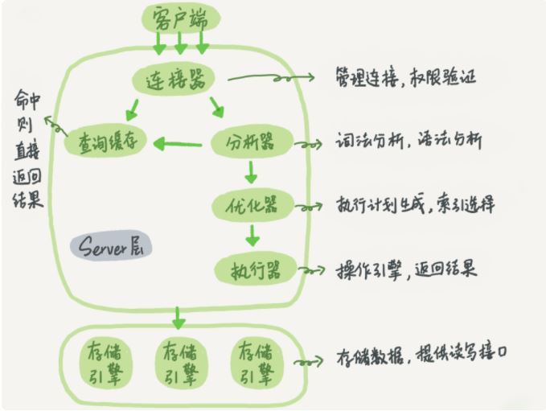

## MySQL体系结构与存储引擎

### 1. MySQL 体系结构

#### 1.1 体系结构

MySQL 主要组件

- 连接器：代码程序和mysql的交互

- 服务层

  - Connection Pool： 连接池，管理和缓冲用户连接、线程处理等

  - Management Service and Utillities：系统管理和控制工具，例如备份恢复、

    Mysql复制、集群等 

  - SQL interface：接受用户的 SQL 命令，并且返回用户需要查询的结果

  - Parser：解析器，验证和解析 SQL 命令

  - Optimizer：优化器，对 SQL 命令进行优化，进行索引选择等

  - Caches & Buffers：缓存信息，对表的更改将导致该表缓存失效；8.0 版本之后移除查询缓存功能

- 存储引擎：负责数据的存储和提取

- 存储层：将数据存储在文件系统上，完成与存储引擎的交互

#### 1.2 查询语句执行流程

查询语句执行流程：

- 通过连接器连接数据库
- 查询缓存，如果缓存命中，则直接返回结果，否则进入下一步
- 分析器进行词法分析、语法分析
- 优化器进行优化，选择索引或多表查询决定表的连接顺序
- 执行器判断权限，调用引擎的接口进行查询，将结果返回给客户端

#### 1.3 更新语句执行流程

除了查询流程的部分，更新语句会清空查询缓存，并设置redo log 重做日志 和 bin log 归档日志

- redo log：InnoDB 专有，记录物理改动，即数据变化；当更新数据时，先写入 redo log，更新内存，等到合适的时机写入磁盘；redo log 大小固定，超过上限则进行覆盖，故只能保存一定时间的记录
- binlog：server 层共有，记录逻辑，即 SQL 语句

### 2. 存储引擎

#### 2.1 概述

存储引擎是数据增删改查等计数的实现方式，存储引擎是 **基于表** 的，也称为表类型

常用存储引擎的特点：

| 特点         | InnoDB         | MyISAM | MEMORY |
| ------------ | -------------- | ------ | ------ |
| **事务安全** | 支持           |        |        |
| **锁机制**   | **行锁**       | 表锁   | 表锁   |
| 哈希索引     |                |        | 支持   |
| 全文索引     | 5.6 版本后支持 | 支持   |        |
| **外键**     | 支持           |        |        |

#### 2.2 InnoDB

InnoDB 是 MySQL 的默认存储引擎，提供了事务操作，但相比 MyISAM，InnoDB 写处理效率有所降低，并占用更多的磁盘空间存储数据和索引

#### 2.3 MyISAM

MyISAM 不支持事务、外键，访问速度较快

#### 2.4 Memory

MEMORY 存储引擎默认使用哈希索引，存储数据的位置是内存，磁盘文件只存储表结构，因此访问速度最快，但是断电即失，安全上没有保障

#### 2.5 存储引擎选择

- InnoDB：大部分场景选用的存储引擎，特别是需要数据一致性和完整性的场合
- MyISAM：适用于读、插入操作为主，且不要求数据一致性，并发不高的场合
- MEMORY：适合需要快速访问，且不需要保证安全性的场合，例如临时表