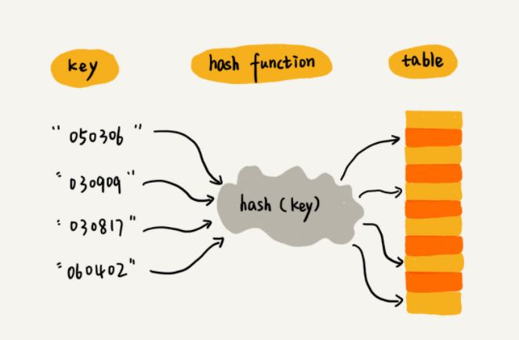

## 哈希表

### 1. Hash表


哈希表将某个 key 映射为数组下标



可能有多个 key 映射到同一个下标，以下是解决哈希冲突的方法

- 开放寻址法：出现了 hash 冲突后，重新探测一个空闲位置插入。适用于数据量小、装载因子小的场合，例如 `java.lang.ThreadLocalMap`
- 链表法：将同一个数组下标的对象用链表组合。当冲突较多时采用红黑树代替链表提升搜索效率


### 2. 位图

#### 2.1 介绍

位图是一种特殊的哈希表，通过 **位** 来存储信息，0/1 来表示是否存在

位图大大降低了内存开销，但缺点是标志位只有0/1，只能用于判断该对象是否存在

``` java
public class BitMap { 
  private char[] bytes; // Java 中 char 类型占 16bit，也即是 2 个字节
  private int nbits;
  
  public BitMap(int nbits) {
    this.nbits = nbits;
    this.bytes = new char[nbits/16+1];
  }
 
  public void set(int k) {
    if (k > nbits) return;
    // byteIndex与bitIndex决定了k在位图中的位置
    int byteIndex = k / 16;
    int bitIndex = k % 16;
    bytes[byteIndex] |= (1 << bitIndex);
  }
 
  public boolean get(int k) {
    if (k > nbits) return false;
    int byteIndex = k / 16;
    int bitIndex = k % 16;
    return (bytes[byteIndex] & (1 << bitIndex)) != 0;
  }
}
```

#### 2.2 布隆过滤器

如果数据范围在 1 到 100 亿，对于位图而言内存开销依然十分巨大

布隆过滤器是对位图的改进，布隆过滤器可以用较少的位表示更大的数，固定位的个数为 K 

其核心思想是：使用多个哈希函数，将该对象映射到 [0, K-1]，并将各个映射对应的位至为 1，当查询某个对象是否存在时，使用这些哈希函数进行映射，如果对应的位不为 1，则该对象不存在

由于哈希冲突，布隆过滤器会存在 **误判**，但仅针对该对象存在的情况会产生误判，如果经过布隆过滤器判断该对象不存在，则真实情况一定不存在该对象

