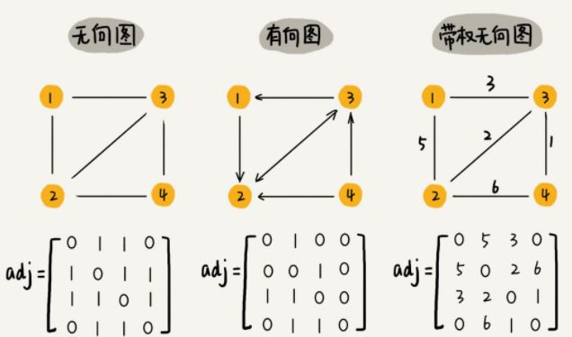
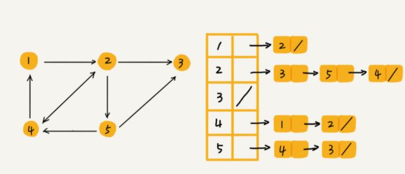
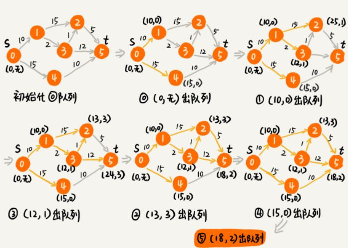

## 图

### 1. 介绍

#### 1.1 概念

图由 **顶点** 和 **边** 组成，按不同特点可分为有向图和无向图，带权图和无权图，树就是一种有向无权图

- 度：顶点所连接的边的数量
- 入度：指向该顶点的边的数量
- 出度：以该顶点为起点的边的数量

#### 1.2 存储方式

##### 1.2.1 邻接矩阵

图一共有 n 个顶点，通过一个 n*n 的矩阵记录顶点之间边的情况，查找速度快，但内存开销大，

 

##### 1.2.2 邻接表

邻接表通过数组 + 链表的形式存储图，内存开销小，但查找速度有所降低



### 2. 拓扑排序

拓扑排序将有向图的顶点排成一个线性序列，主要用于 **组织工作顺序或者判断有先后依赖的工作能否完成**

构造图：如果任务 s 先于 t 执行，则添加一条 s 指向 t 的边。如果顶点入度为 0，则该顶点可以执行

拓扑排序的主要方法有 Kahn 算法和 DFS 算法

#### 2.1 Kahn 算法

Kahn 算法工作流程：寻找一个入度为 0 的顶点，将其添加到拓扑排序结果序列，将该顶点删除。不断重复该过程，即可得到拓扑排序的结果

Kahn 算法的复杂度为 O(V+E)，V 为顶点个数，E 为边的个数

``` java
public void topoSortByKahn() {
  int[] inDegree = new int[v]; // 统计每个顶点的入度
  for (int i = 0; i < v; ++i) {
    for (int j = 0; j < adj[i].size(); ++j) {
      int w = adj[i].get(j); // i->w
      inDegree[w]++;
    }
  }
  LinkedList<Integer> queue = new LinkedList<>();
  for (int i = 0; i < v; ++i) {
    if (inDegree[i] == 0) queue.add(i); // 添加初始节点
  }
  while (!queue.isEmpty()) {
    int i = queue.remove();
    System.out.print("->" + i); // 这里选择将节点输出，实际使用将其加入结果序列
    for (int j = 0; j < adj[i].size(); ++j) {
      int k = adj[i].get(j);
      inDegree[k]--;
      if (inDegree[k] == 0) queue.add(k);
    }
  }
}
```

#### 2.2 DFS

DFS 进行拓扑排序的流程

- 通过邻接表构造逆连接表
- 递归处理每个节点，先添加所有可达节点，再添加本节点

DSF 求解拓扑排序的复杂度为 O(V+E)

``` java
public void topoSortByDFS() {
  // 先构建逆邻接表，边 s->t 表示，s 依赖于 t，t 先于 s
  LinkedList<Integer> inverseAdj[] = new LinkedList[v];
  for (int i = 0; i < v; ++i) {
    inverseAdj[i] = new LinkedList<>();
  }
  for (int i = 0; i < v; ++i) { // 通过邻接表生成逆邻接表
    for (int j = 0; j < adj[i].size(); ++j) {
      int w = adj[i].get(j); // i->w
      inverseAdj[w].add(i); // w->i
    }
  }
  boolean[] visited = new boolean[v];
  for (int i = 0; i < v; ++i) { // 深度优先遍历图
    if (visited[i] == false) {
      visited[i] = true;
      dfs(i, inverseAdj, visited);
    }
  }
}
 
private void dfs(
    int vertex, LinkedList<Integer> inverseAdj[], boolean[] visited) {
  for (int i = 0; i < inverseAdj[vertex].size(); ++i) {
    int w = inverseAdj[vertex].get(i);
    if (visited[w] == true) continue;
    visited[w] = true;
    dfs(w, inverseAdj, visited);
  } // 先把 vertex 这个顶点可达的所有顶点都打印出来之后，再打印它自己
  System.out.print("->" + vertex);
}
```

### 3. 最短路径

最短路径的常用算法为 Dijkstra 算法和 Floyd 算法

#### 3.1 Dijkstra

Dijkstra 采用了贪心思想，主要流程如下：

- 记录起点到各个顶点的最短距离 dist 以及已经找到最短路径的顶点的集合 T，

  初始时起点 s 的权重 dist[s] 被赋为 0，对于 s 能到达的顶点 m，将 dist[m] 赋值为相应的权重

- 从 dist 数组选择最小值，将对应的顶点 p 加入 T，更新 p 能到达的顶点的 dist 数组

- 不断重复上述过程，直到 T 包含所有节点

Dijkstra 算法的时间复杂度为 O(E*logV)，V 为顶点个数，E 为边的个数(如果采用数组则是 O(E * V))



``` java
public class Graph { // 有向有权图的邻接表表示
  private LinkedList<Edge> adj[]; // 邻接表
  private int v; // 顶点个数
 
  public Graph(int v) {
    this.v = v;
    this.adj = new LinkedList[v];
    for (int i = 0; i < v; ++i) {
      this.adj[i] = new LinkedList<>();
    }
  }
 
  public void addEdge(int s, int t, int w) { // 添加一条边
    this.adj[s].add(new Edge(s, t, w));
  }
 
  private class Edge {
    public int sid; // 边的起始顶点编号
    public int tid; // 边的终止顶点编号
    public int w; // 权重
    public Edge(int sid, int tid, int w) {
      this.sid = sid;
      this.tid = tid;
      this.w = w;
    }
  }
  // 下面这个类是为了 dijkstra 实现用的
  private class Vertex {
    public int id; // 顶点编号 ID
    public int dist; // 从起始顶点到这个顶点的距离
    public Vertex(int id, int dist) {
      this.id = id;
      this.dist = dist;
    }
  }
}
```

``` java
// 因为 Java 提供的优先级队列，没有暴露更新数据的接口，所以我们需要重新实现一个
private class PriorityQueue { // 根据 vertex.dist 构建小顶堆
  private Vertex[] nodes;
  private int count;
  public PriorityQueue(int v) {
    this.nodes = new Vertex[v+1];
    this.count = v;
  }
  public Vertex poll() { // TODO: 留给读者实现... }
  public void add(Vertex vertex) { // TODO: 留给读者实现...}
  // 更新结点的值，并且从下往上堆化，重新符合堆的定义。时间复杂度 O(logn)。
  public void update(Vertex vertex) { ... } 
  public boolean isEmpty() { ... }
}
 
public void dijkstra(int s, int t) { // 从顶点 s 到顶点 t 的最短路径
  int[] predecessor = new int[this.v]; // 用来还原最短路径
  Vertex[] vertexes = new Vertex[this.v];
  for (int i = 0; i < this.v; ++i) {
    vertexes[i] = new Vertex(i, Integer.MAX_VALUE);
  }
  PriorityQueue queue = new PriorityQueue(this.v);// 小顶堆
  boolean[] inqueue = new boolean[this.v]; // 标记是否进入过队列
  vertexes[s].dist = 0;
  queue.add(vertexes[s]);
  inqueue[s] = true;
  while (!queue.isEmpty()) {
    Vertex minVertex= queue.poll(); // 取堆顶元素并删除
    if (minVertex.id == t) break; // 最短路径产生了
    for (int i = 0; i < adj[minVertex.id].size(); ++i) {
      Edge e = adj[minVertex.id].get(i); // 取出一条 minVetex 相连的边
      Vertex nextVertex = vertexes[e.tid]; // minVertex-->nextVertex
      if (minVertex.dist + e.w < nextVertex.dist) { // 更新 next 的 dist
        nextVertex.dist = minVertex.dist + e.w;
        predecessor[nextVertex.id] = minVertex.id;
        if (inqueue[nextVertex.id] == true) {
          queue.update(nextVertex); // 更新队列中的 dist 值
        } else {
          queue.add(nextVertex);
          inqueue[nextVertex.id] = true;
        }
      }
    }
  }
  // 输出最短路径
  System.out.print(s);
  print(s, t, predecessor);
}
 
private void print(int s, int t, int[] predecessor) {
  if (s == t) return;
  print(s, predecessor[t], predecessor);
  System.out.print("->" + t);
}
```

