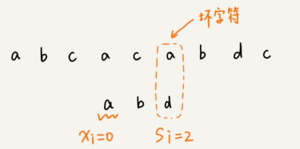
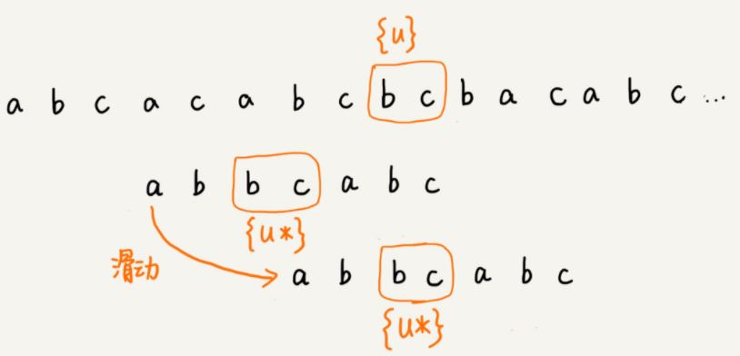
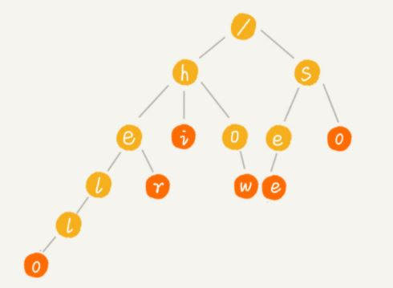
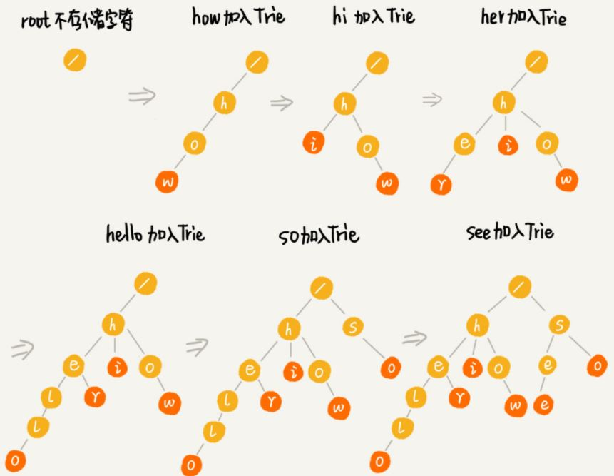
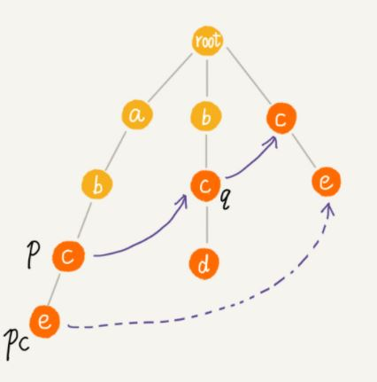

## 字符串匹配

### 1. RK 算法

BF Brute Force，即暴力匹配算法，算法复杂度为 O(m*n)，故采用 RK 算法进行改善

RK 算法：主串长度为 n，模式串长度为 n，在主串中将会有 n-m+1 个子串，只需要比较字串与模式串即可，BF 算法在这个环节采用逐个字符比较，而 RK 算法采用 hash 值比较，并且相邻字串的 hash 计算有特定公式，能够减少计算量。

RK 算法的时间复杂度为 O(n)，但当哈希冲突严重时，将会退化到 O(m*n)


### 2. BM 算法

BM 算法主要包含 **坏字符规则** 和 **好后缀规则**

#### 2.1 坏字符

按模式串 **从后往前** 匹配，首个没法匹配的字符称为 **坏字符**， 将下标记为 si，记坏字符在模式串的下标为 xi，模式串如果不含该字符，xi = -1。可以将模式串向后移动 si - xi 个字符




 ``` java
private static final int SIZE = 256; // 字符数量
private void generateBC(char[] b, int m, int[] bc) {
  for (int i = 0; i < SIZE; ++i) {
    bc[i] = -1; // 初始化 bc
  }
  for (int i = 0; i < m; ++i) {
    int ascii = (int)b[i];
    bc[ascii] = i;
  }
}
 ```

``` java
public int bm(char[] a, int n, char[] b, int m) {
  int[] bc = new int[SIZE];
  generateBC(b, m, bc); // 构建坏字符哈希表
  int i = 0;
  while (i <= n - m) {
    int j;
    for (j = m - 1; j >= 0; --j) { // 模式串从后往前匹配
      if (a[i+j] != b[j]) break; // 坏字符对应模式串中的下标是 j
    }
    if (j < 0) {
      return i; // 匹配成功，返回主串与模式串第一个匹配的字符的位置
    }
    // 坏字符规则移动
    i = i + (j - bc[(int)a[i+j]]); 
  }
  return -1;
}
```

#### 2.2 好后缀

好后缀是主串与模式串末尾已经匹配的部分，如果在模式串中存在该字符串，则可向后移动直至对齐



``` c
// b 表示模式串，m 表示长度，suffix，prefix 数组事先申请好了
private void generateGS(char[] b, int m, int[] suffix, boolean[] prefix) {
  for (int i = 0; i < m; ++i) { // 初始化
    suffix[i] = -1;
    prefix[i] = false;
  }
  for (int i = 0; i < m - 1; ++i) { // b[0, i]
    int j = i;
    int k = 0; // 公共后缀子串长度
    while (j >= 0 && b[j] == b[m-1-k]) { // 与 b[0, m-1] 求公共后缀子串
      --j;
      ++k;
      suffix[k] = j+1; //j+1 表示公共后缀子串在 b[0, i] 中的起始下标
    }
    i
    if (j == -1) prefix[k] = true; // 如果公共后缀子串也是模式串的前缀子串
  }
}

// j 表示坏字符对应的模式串中的字符下标 ; m 表示模式串长度
private int moveByGS(int j, int m, int[] suffix, boolean[] prefix) {
  int k = m - 1 - j; // 好后缀长度
  if (suffix[k] != -1) return j - suffix[k] +1;
  for (int r = j+2; r <= m-1; ++r) {
    if (prefix[m-r] == true) {
      return r;
    }
  }
  return m;
}
```

#### 2.3 BM算法

BM 算法即综合了两个规则，每次选择最大的移动长度

``` c
// a,b 表示主串和模式串；n，m 表示主串和模式串的长度。
public int bm(char[] a, int n, char[] b, int m) {
  int[] bc = new int[SIZE]; // 记录模式串中每个字符最后出现的位置
  generateBC(b, m, bc); // 构建坏字符哈希表
  int[] suffix = new int[m];
  boolean[] prefix = new boolean[m];
  generateGS(b, m, suffix, prefix);
  int i = 0; // j 表示主串与模式串匹配的第一个字符
  while (i <= n - m) {
    int j;
    for (j = m - 1; j >= 0; --j) { // 模式串从后往前匹配
      if (a[i+j] != b[j]) break; // 坏字符对应模式串中的下标是 j
    }
    if (j < 0) {
      return i; // 匹配成功，返回主串与模式串第一个匹配的字符的位置
    }
    int x = j - bc[(int)a[i+j]];
    int y = 0;
    if (j < m-1) { // 如果有好后缀的话
      y = moveByGS(j, m, suffix, prefix);
    }
    i = i + Math.max(x, y);
  }
  return -1;
}
```


### 3. KMP算法

KMP 算法的思想类似 BM 算法，当遇到不能匹配的字符后，将主串向后移动相应距离

KMP 通过 **next数组** 记录能匹配的长度，使用动态规划构造该数组

``` c
// b 表示模式串，m 表示模式串的长度
private static int[] getNexts(char[] b, int m) {
  int[] next = new int[m];
  next[0] = -1;
  int k = -1;
  for (int i = 1; i < m; ++i) {
    while (k != -1 && b[k + 1] != b[i]) {
      k = next[k];
    }
    if (b[k + 1] == b[i]) {
      ++k;
    }
    next[i] = k;
  }
  return next;
}
```

``` c
// a, b 分别是主串和模式串；n, m 分别是主串和模式串的长度。
public static int kmp(char[] a, int n, char[] b, int m) {
  int[] next = getNexts(b, m);
  int j = 0;
  for (int i = 0; i < n; ++i) {
    while (j > 0 && a[i] != b[j]) { // 一直找到 a[i] 和 b[j]
      j = next[j - 1] + 1;
    }
    if (a[i] == b[j]) {
      ++j;
    }
    if (j == m) { // 找到匹配模式串的了
      return i - m + 1;
    }
  }
  return -1;
}
```

KMP 算法的时间复杂度为 O(m+n)，空间复杂度为 O (n)


### 4. Trie树

#### 4.1 简介

Trie 树又称字典树，是一种专门处理字符串匹配的数据结构，用于在字符串几何中查找某个字符串

Trie 树特点：

- 根节点不包含任何信息，每个节点表示一个字符
- 从根节点到红色节点的路径表示一个字符串，红色节点不一定是叶子节点



#### 4.2 字典树的实现

为了保证查找的高效性，可以使用数组模拟哈希表，存储下个字符对应的字典树

``` java
  public class TrieNode {
    public char data;
    public TrieNode[] children = new TrieNode[26];
    public boolean isEndingChar = false; // 是否末尾字符
  }
```

字典树的插入过程



``` java
  public void insert(char[] text) {
    TrieNode p = root;
    for (int i = 0; i < text.length; ++i) {
      int index = text[i] - 'a'; // 字符对应下标
      if (p.children[index] == null) {
        TrieNode newNode = new TrieNode(text[i]);
        p.children[index] = newNode;
      }
      p = p.children[index];
    }
    p.isEndingChar = true;
  }
```

字典树的查找过程

``` java
  // 在 Trie 树中查找一个字符串
  public boolean find(char[] pattern) {
    TrieNode p = root;
    for (int i = 0; i < pattern.length; ++i) {
      int index = pattern[i] - 'a';
      if (p.children[index] == null) {
        return false; // 不存在该字符
      }
      p = p.children[index];
    }
    if (p.isEndingChar == false) return false; // 不能完全匹配，只是前缀
    else return true; // 找到该字符串
  }
```

字典树的插入的时间复杂度为 O(n)，查找的复杂度为 O(n)，n 为插入字符串的长度

#### 4.3 适用场景

字典树适用于查找 **前缀匹配** 的字符串

缺点：

- 空间开销大
- 使用指针连接，对缓存不友好


#### 5. AC 自动机

AC 自动机于 Trie 树类似 KMP 于 BF 算法，构建了失败指针实现快速匹配

AC 自动机最长情况下的时间复杂度为 O(n*len)，实际情况下可能近似于 O(n)，len 为模式串的平均长度

AC 自动机主要用于 **查找文本中的敏感词汇**，模式串即为敏感词汇

``` java
public class AcNode {
  public char data; 
  public AcNode[] children = new AcNode[26];
  public boolean isEndingChar = false; // 是否为结尾字符
  public int length = -1; // 模式串长度
  public AcNode fail; // 失败指针
}
```

**构建失败指针**

模式串的失败指针指向其他 **最长可匹配后缀子串** 的末尾



 ``` java
public void buildFailurePointer() {
  Queue<AcNode> queue = new LinkedList<>();
  root.fail = null;
  queue.add(root);
  while (!queue.isEmpty()) {
    AcNode p = queue.remove();
    for (int i = 0; i < 26; ++i) {
      AcNode pc = p.children[i];
      if (pc == null) continue;
      if (p == root) {
        pc.fail = root;
      } else {
        AcNode q = p.fail;
        while (q != null) {
          AcNode qc = q.children[pc.data - 'a'];
          if (qc != null) {
            pc.fail = qc;
            break;
          }
          q = q.fail;
        }
        if (q == null) {
          pc.fail = root;
        }
      }
      queue.add(pc);
    }
  }
}
 ```

**匹配**

``` java
public void match(char[] text) { // text 是主串
  int n = text.length;
  AcNode p = root;
  for (int i = 0; i < n; ++i) {
    int idx = text[i] - 'a';
    while (p.children[idx] == null && p != root) {
      p = p.fail; // 失败指针发挥作用的地方
    }
    p = p.children[idx];
    if (p == null) p = root; // 如果没有匹配的，从 root 开始重新匹配
    AcNode tmp = p;
    while (tmp != root) {
      if (tmp.isEndingChar == true) {
        int pos = i-tmp.length+1; // 匹配起始下标
      }
      tmp = tmp.fail;
    }
  }
}
```

