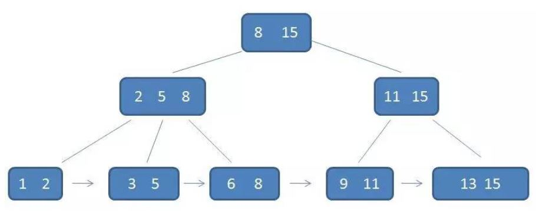

## 树

### 1. 树的相关概念

- 节点高度：节点到叶子节点的最长路径边数
- 节点深度：根节点到该节点所经历的边的个数
- 节点层数：节点深度 + 1
- 树的高度：根节点的高度


### 2. 红黑树

红黑树是一种近似平衡的二叉搜索树，并满足以下要求：

- 根节点是黑色
- 叶节点是黑色空节点
- 相邻节点不为红色
- 每个节点到可达叶节点的路径包含相同的黑色节点，即 **黑高度** 相等

红黑树的插入、删除、查找的时间复杂度均为 O(logn)


### 3. 堆

#### 1. 介绍

堆是一种抽象的完全二叉树，使用数组存储，如果数组的第一个元素置为空，则第 i 个节点的左右子节点对应的数组下标分别为 2i、2i + 1


堆的特点是 **每一个节点的值都大/小于等于子节点的值**，并分为大根堆与小根堆，用于实现优先级队列

#### 2. 堆的实现

##### 插入

堆插入元素即将该元素放置于末尾，并通过上浮不断进行交换， 将其放到合适的位置

``` java
  public void insert(int data) {
    if (count >= n) return; // 堆满了
    ++count;
    a[count] = data;
    int i = count;
    // 自下往上堆化
    while (i/2 > 0 && a[i] > a[i/2]) { 
      swap(a, i, i/2);
      i = i/2;
    }
  }
```

##### 删除堆顶元素

堆删除堆顶元素后，将最后一个元素放于堆顶，并通过下浮不断交换

``` java
public void removeMax() {
  if (count == 0) return -1; // 堆中没有数据
  a[1] = a[count]; // a[1]为堆顶元素
  --count;
  heapify(a, count, 1);
}
 
private void heapify(int[] a, int n, int i) {
  // 自上往下堆化  
  while (true) {
    int maxPos = i;
    if (i*2 <= n && a[i] < a[i*2]) maxPos = i*2;
    if (i*2+1 <= n && a[maxPos] < a[i*2+1]) maxPos = i*2+1;
    if (maxPos == i) break;
    swap(a, i, maxPos);
    i = maxPos;
  }
}
```

#### 3. 堆排序

堆排序分为两个主要阶段

- 建堆：从中间位置开始，后续的元素不断上浮建堆，时间复杂度 O(n)

  ``` java
  private static void buildHeap(int[] a, int n) {
    for (int i = n/2; i >= 1; --i) {
      heapify(a, n, i);
    }
  }
  ```

- 排序：选取堆顶元素，放第 n 个位置，重新建堆后选取堆顶元素放第 n - 1 个位置，直到只剩一个元素

  ```java
  public static void sort(int[] a, int n) {
    buildHeap(a, n);
    int k = n;
    while (k > 1) {
      swap(a, 1, k);
      --k;
      heapify(a, k, 1);
    }
  }
  ```

堆排序是 **不稳定** ，时间复杂度为 O(nlogn) 的算法。

#### 4. Top K 问题

Top K 问题分为静态数据与动态数据

- 静态数据：在包含 n 个数据的数组中，查找 Top K 大数据。可以维护一个大小为 K 的小根堆，顺序遍历数组，如果比堆顶元素大，则将堆顶元素删除，将该元素插入堆并重新调整；如果比堆小，则直接跳过。一次堆调整的时间复杂度为 O(logK)，故求解该问题的时间复杂度为 O(nlogK)
- 动态问题：不断有元素插入，并提供访问当前 Top K 元素的功能。解决方式同上


### 4. B与B+树

#### 4.1 介绍

B 树与 B+ 树主要是为了解决磁盘搜索需要多次 IO 的问题，常用于数据库索引

m 阶次 B 树：

- 平衡的多路搜索树，叶节点<font color=blue>高度统一</font>
- 非叶节点不超过 m-1 个关键码，不超过 m 个分支
- 非叶节点分支数大于等于 m/2，根节点分支数大于等于2



B 族树作为索引的优势

- 树的高度很低，IO 次数少
- 一个节点含有多个关键码，符合磁盘<font color=blue>按块读取</font>的特性

#### 4.2 B+ 与 B树

B+ 树相比 B 树具有以下特点：

- 非叶节点不保存数据，只保存索引；叶节点保存数据
- 叶节点通过链表从小到大连接，适合<font color=blue>顺序查找</font>
- 所有查询都要找到叶子节点，查询性能温度，但最优情况性能弱于 B 树

