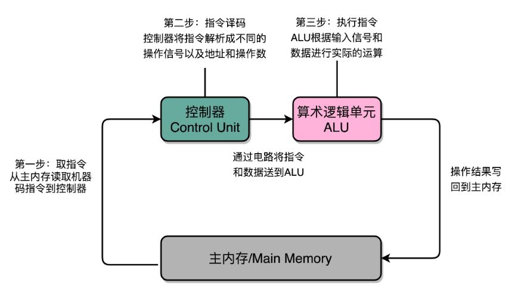
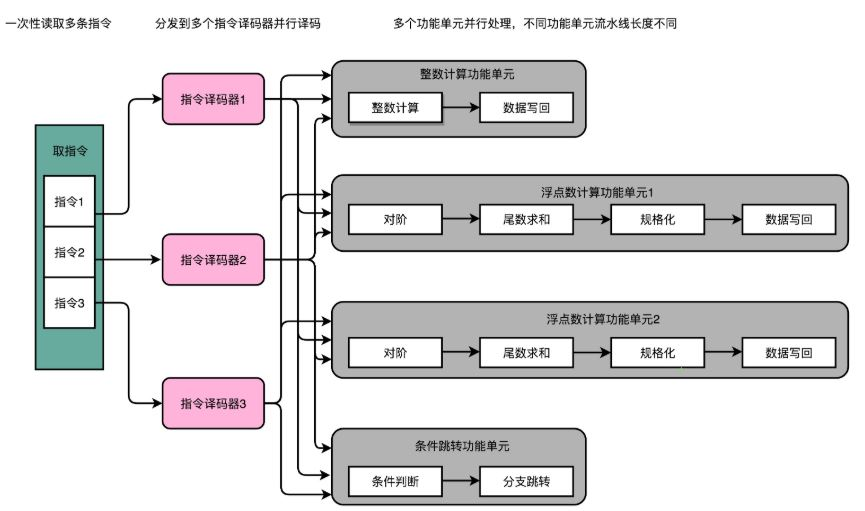
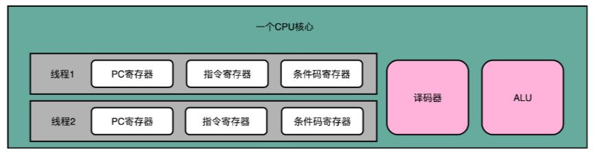
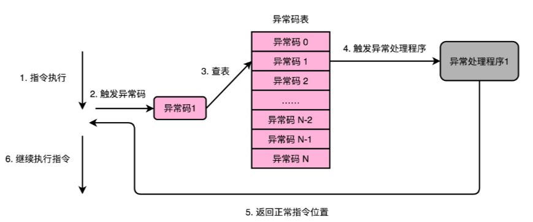
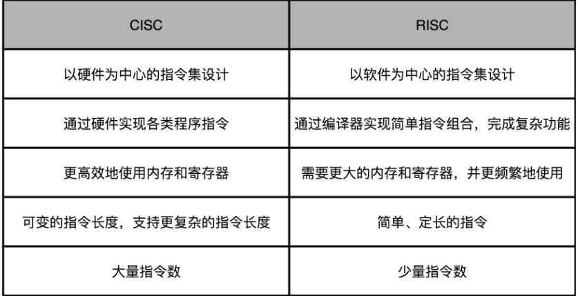

[toc]

## CPU

### 1. CPU 执行指令

CPU 执行一个指令需要经过如下步骤：

- 读取指令
- 指令译码
- 执行操作
- 读取操作数
- 写回寄存器

### 2. 流水线

#### 2.1 介绍

流水线每一级执行一个 CPU 执行步骤

流水线并不是越深越好，流水线越深，受功耗墙限制越大，也加大了乱序执行、分支预测的难度。

#### 2.2 流水线冒险

**冒险**：下一个时钟周期中下一条指令不能执行

分为以下三种情况：

- **结构冒险**：因缺乏硬件支持而导致指令不能按预期完成，例如无空闲寄存器；通过 cache 可以缓解
- **数据冒险**：一条指令必须等待另一条指令的完成，需要在等待指令后加入**气泡**进行阻塞，在气泡中使用**操作数前推**提升效率
- **控制冒险**：在分支判断时，需要等判断条件执行结束，可以通过**分支预测**改善

#### 2.3 乱序执行

有些指令不依赖之前指令的执行结果，可以不按照代码顺序提前执行，例如 Java 单例模式中创建对象时，可能先将引用指向内存，但该内存还未初始化

#### 2.4 多发射与超标量

**多发射**：同一个时间能把多条指令发射到不同的译码器或者后续处理的流水线

**超标量**：突破了一个时钟周期只能执行一个标量的限制

#### 2.5 超线程

区别于软件中的多线程，超线程将一个物理 CPU **分为两个逻辑 CPU** ，例如增加一份寄存器，同时维护两条并型指令，当一个指令在流水线遇到气泡，切换到另一条指令执行，适用于 **IO 密集**场景

### 3. 异常

#### 3.1 异常分类

- **中断**：被来自 I/O 设备的信号打断执行
- **陷阱**：用户主动触发的异常，对应软中断，例如程序的断点
- **故障**：被动触发的异常，例如加法溢出；故障处理完成之后，处理**当前的指令**，而不是下一条指令
- **中止**：遇到故障无法恢复，例如 ECC 内存校验失败

#### 3.2 异常处理

异常处理机制：

- **状态寄存器**：异常程序计数器 EPC 保存出错地址，通过状态寄存器保存异常原因
- **中断向量**：中断向量中保存处理程序的地址，出现异常时 EPC 保存异常地址，控制权转移到处理程序

在 8086 中，可以设置自己的中断向量和中断处理函数，在进入中断前需保存寄存器数据(PUSH 指令)，通过 INT 产生中断，在中断退出前恢复寄存器数据(POP 指令)

### 4. 指令集

- **复杂指令集 CISC**：有复杂指令需要在多 CPU 周期内，代表 Intel 的 X86 架构

- **精简指令集 RISC** ：指令都在单 CPU 周期内完成，代表 ARM 架构

**微指令**：指令译码时，不再是一条复杂指令，而是定长的微指令，**L0 Cache** 缓存了 CISC 到微指令的翻译结果