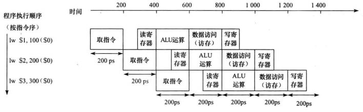

[toc]

## CPU

### 1. 流水线

#### 1.1 介绍

通常，一个指令需要经过如下步骤：

- 读取指令
- 指令译码
- 执行操作
- 读取操作数
- 写回寄存器

流水线每一级执行一个步骤

#### 1.2 流水线冒险

**冒险**：下一个时钟周期中下一条指令不能执行

分为以下三种情况：

- **结构冒险**：因缺乏硬件支持而导致指令不能按预期完成，例如无空闲寄存器
- **数据冒险**：一条指令必须等待另一条指令的完成，需要在等待指令后加入**气泡**进行阻塞
- **控制冒险**：在分支判断时，需要等判断条件执行结束，可以通过**分支预测**改善

### 2. 异常

异常处理机制：

- **状态寄存器**：异常程序计数器 EPC 保存出错地址，通过状态寄存器保存异常原因
- **中断向量**：EPC 保存地址，控制权被转移到中断向量中的地址

在 8086 中，可以设置自己的中断向量和中断处理函数，在进入中断前需保存寄存器数据(PUSH 指令)，通过 INT 产生中断，在中断退出前恢复寄存器数据(POP 指令)