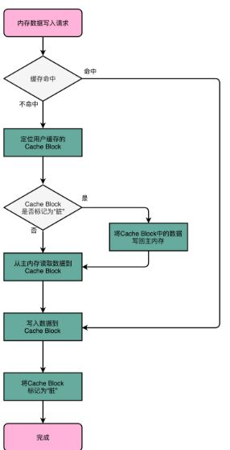

[toc]

## 存储器

### 1. 概述

#### 1.1 分类

- **SRAM**：静态存储器，读写速度快，举例 CPU Cache
- **DRAM**：动态存储器，读写速度慢，集成度高，举例内存

- **硬盘**

#### 1.2 层次关系

### 2. 局部性原理

- **时间局部性**：一个刚被访问的数据在短时间大概率被再次访问
- **空间局部性**：刚被访问的数据相邻的数据很快会被访问

LRU 算法的理论基础

### 3. CPU Cache

#### 3.1 使用 Cache 的原因

**内存墙**：内存的性能远低于 CPU，限制了 CPU 性能的发挥

**cache 的作用**：将指令和数据进行缓存，CPU 优先从 cache 中读取，减轻内存墙的限制

#### 3.2 缓存一致性 

CPU 数据写入内存的两个策略

- **写直达 Write-Through**：写入前检查 cache，缓存命中则更新 cache，无论是否命中都将数据写入内存

- **写回 Write-Back**：如果要写入的数据存放在 cache 中且不为脏数据，则只更新 cache，并标记为脏数据；如果为脏数据，则先写入内存，再更新 cache

现代 CPU 每个核心都会拥有缓存，故需要保证缓存的一致性

保证缓存一致性的两个要求：

- **写传播**：一个核心中 cache 数据更新，能够通知到其他核心的 cache中
- **事务串行化**：所有核心看到的各核心的**读写顺序是一致的**

**MESI 协议**

MESI 基于**总线嗅探**机制，即所有读写请求通过总线广播，CPU 核心根据广播进行更新

MESI 是一种**写失效**的协议，**写失效**：只有一个 CPU 核心负责写，其他的核心同步读取到这个写入。在这个 CPU 核心更新 Cache 之后，会去广播一个“失效”请求，其他的 CPU 核心将相应的 Cache Block 标记成失效

MESI 对应着 Cache Line 的四个标记

- M：已修改，Modified，脏数据
- E：独占，Exclusive；当前数据为该 Cache独占，写入不需要广播，如果接收到读取请求，则转变为 S 标记
- S：共享，Shared；写入前需要进行广播，要求其他核心的 cache 失效，再更新数据
- I：已失效，Invalidated，脏数据

