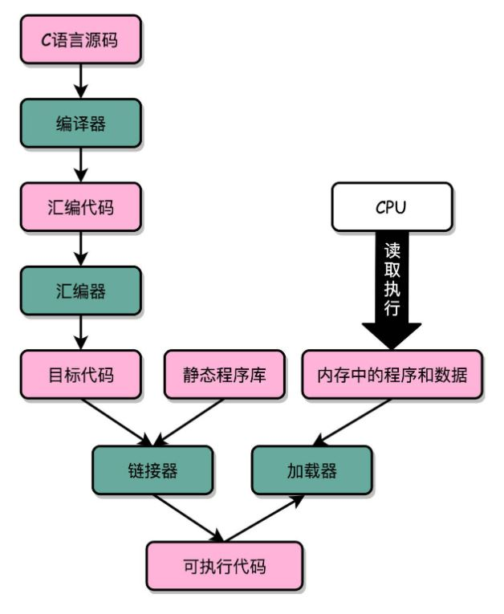
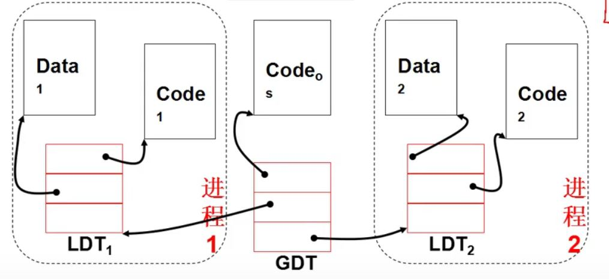

[toc]

## 指令

### 1. C++ inline 指令层实现

在 C++ 中，如果一个函数是 inline 的，那么在指令层面，将会省去函数调用的流程(CALL 指令)，而是直接复制指令执行，优点是提高了运行速度，缺点是增大了程序占用的空间

### 2. 编译、汇编、链接

主要流程：

Linux 使用 **ELF** 格式保存目标文件，Windows 使用 **PE** 格式，MacOS 使用 macho 格式 

### 3.保护模式

#### 3.1 介绍

实模式：例如 8086 访问内存，段寄存器保存段基址，物理地址 = 段基址左移 4 位 + 偏移地址

保护模式：段寄存器保存段选择子；引入保护模式是为了防止程序随意访问内存

概念：

- 段描述符：包括段物理首地址、段界限、段属性（包括特权级等）
- 描述符表：存储所使用的段描述符，放置在内存中

- 段选择子：所要访问的段在描述符表中的偏移
- GDT：全局描述表，只有一份，包含操作系统的段描述符和进程的 LDT
- LDT：局部描述表，每个进程一份，存储该进程使用的段描述符

#### 3.2 工作流程

- 段寄存器存放段选择子，GDTR 寄存器存放段描述符表的首地址
- 通过段选择子和 GDTR 得到对应的段描述符
- 通过段描述符得到对应段在内存的首地址，加上偏移地址即可得到真实物理地址

