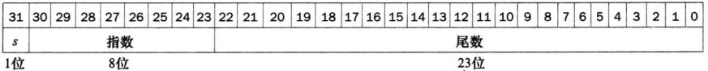
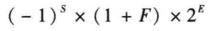

[toc]

## 编码与运算

### 1. 整数表示

- **原码**：符号位 + 绝对值，最高位表示符号
- **反码**：正数反码等于本身，负数符号位不变，其余取反
- **补码**：正数补码等于本身，负数等于反码 + 1


### 2. 浮点运算

#### 2.1 浮点表示

浮点数的表示包括符号位、指数、尾数



所表示的浮点数大小为



#### 2.2 浮点加法

浮点数进行加法的步骤

- 对齐：较小指数的数向较大指数的数对齐
- 相加：将尾数相加
- 规格化：类似于 11* 1e5 转为 1.1 * 1e6，并检查溢出情况
- 舍入：舍去超过位数的部分

注：相差过大的浮点数进行加法，可能导致大数吃小数的情况，可以使用**Kahan Summation**算法解决

``` java
public class KahanSummation {
  public static void main(String[] args) {
    float sum = 0.0f;
    float c = 0.0f;
    // 2千万个1.0f相加
    for (int i = 0; i < 20000000; i++) {
    	float x = 1.0f;
    	float y = x - c; // 当前数字和上次误差之和, c一定非正
    	float t = sum + y;
    	c = (t-sum)-y; // 计算丢失的精度
    	sum = t;    	
    }
    System.out.println("sum is " + sum);   
  }	
}
```

