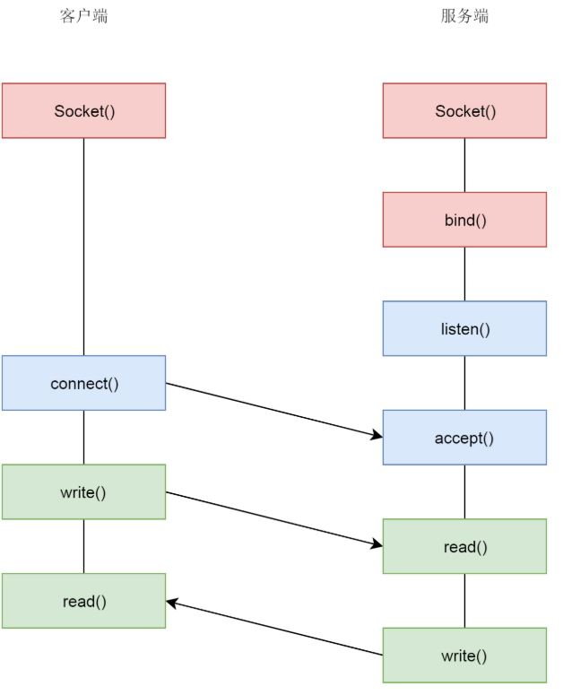

[toc]

## Socket

### 1. API

应用程序与网络协议进行交互的接口

#### 1. 1 调用TCP

- 客户端与服务端建立 socket 之后，服务端通过 bind() 监听 某个 IP 地址的端口(服务器拥有多张网卡对应多个 IP，指定 0.0.0.0 则全部监听)，进入连接阶段
- 服务端调用 listen() 进入三次握手的 LISTEN 状态，调用 accept() 等待完成至少一个连接
- 客户端调用 connect() 发起连接
- 成功连接之后，通过 read 和 write 来读写数据，类似操作文件流

注：监听和传输数据为**不同的socket**，分为监听 socket 和 已连接 socket

#### 1.2 调用 UDP

UDP 因为无连接，故不需要 connet() 和 accept()，通信时，调用 sendto() 和 recvfrom()，都要传入 IP 地址和端口

#### 1.3 Linux 的 Socket API 实现

