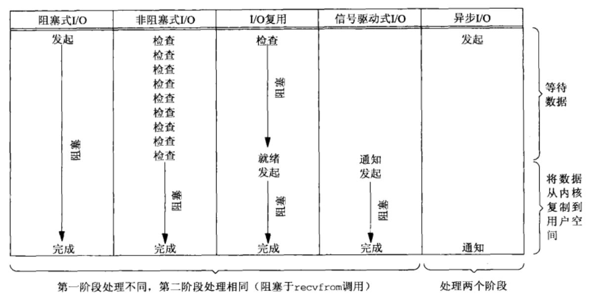

[toc]

## Socket

### 1. API

应用程序与网络协议进行交互的接口

#### 1.1 调用TCP


- 客户端与服务端建立 socket 之后，服务端通过 bind() 监听 某个 IP 地址的端口(服务器拥有多张网卡对应多个 IP，指定 0.0.0.0 则全部监听)，进入连接阶段
- 服务端调用 listen() 进入三次握手的 LISTEN 状态，调用 accept() 等待完成至少一个连接
- 客户端调用 connect() 发起连接
- 成功连接之后，通过 read 和 write 来读写数据，类似操作文件流

注：监听和传输数据为**不同的socket**，分为监听 socket 和 已连接 socket

#### 1.2 调用 UDP


UDP 因为无连接，故不需要 connet() 和 accept()，通信时，调用 sendto() 和 recvfrom()，都要传入 IP 地址和端口


### 2. Linux 的五种 I/O模型

#### 2.1 阻塞式 I/O

在数据从内核缓冲区复制到进程缓冲区之前，进程都被阻塞，阻塞进程不会使用 CPU，socket 的默认模式


#### 2.2 非阻塞式 I/O

执行系统调用后，内核返回一个错误码，应用进程继续执行，但需要**轮询**检验 I/O 情况(注：数据拷贝时仍是阻塞的)


#### 2.3 I/O 多路复用

等待多个 I/O 中的一个完成，等待过程被阻塞，令单进程具有处理多个 I/O 事件的能力，又称事件驱动I/O， select/poll/epoll 使用的模式


#### 2.4 信号驱动 I/O

进程使用 sigaction 系统调用，内核立即返回，应用进程可以继续执行，等待过程是非阻塞的。I/O 可以开始进行时内核向进程发送 SIGIO 信号，进程在信号处理程序中调用 recvfrom


#### 2.5 异步 I/O


进程执行 aio_read 系统调用，内核立即返回，进程不会阻塞，内核在 I/O 完成之后向进程发送信号。

异步 I/O 与信号驱动 I/O 的区别：异步 I/O 通知进程 I/O 完成，信号驱动 I/O 通知进程可以开始 I/O。

#### 2.6 五种 IO 的比较




### 3. select/poll/epoll

select/poll/epoll 均为 IO 多路复用。

#### 3.1 select

方法参数：

``` c
int select(int maxfdp1, fd_set *readfds, fd_set *writefds, fd_set *exceptfds, 
           struct timeval *timeout);
```

- maxfdp1 指定待测试文件描述符个数，描述符 0 到 `maxfdp1`-1 将被测试
- fd_set 数据结构底层使用数组实现，只能监听少于 FD_SETSIZE 数量的描述符，使用位图的思想，每一位对应一个描述符，
- readset、writeset、exceptset，分别对应读、写、异常条件的扫描符
- timeout 为超时参数，调用 select 会一直阻塞直到有描述符的事件到达或者等待的时间超过 timeout，如果设置为 0 则为轮询模式
- 成功调用返回结果大于 0（fd_set 中位 1 的个数，即就绪的描述符个数），出错返回结果为 -1，超时返回结果为 0

机制：fd_set 内部的元素都与文件描述符关联，当调用 select 时，该进程阻塞，内核根据 IO 状态修改 fd_set 的内容通知调用进程，调用者需要通过 **循环遍历 fd_set 判断该描述符是否就绪**，再进行相应的操作。

``` c
        ret = select(...);
        // 没有有效连接
        if(ret < 0) {
            ...
        }
        // 超时
        else if(ret == 0)
        {
            ...
        }
        for(i = 0; i < conn_amount; i++)
        {
            // 该连接有效
            if(FD_ISSET(fd[i],&fdsr))
            {
                // 相应操作
                ...
            }
        }
```

缺点：

- 开销大，需要复制 fd_set 到内核态，并且在内核态进行遍历；
- 有连接上限，受到内核宏 FD_SETSIZE 的限制

#### 3.2 poll

poll 与 select 功能基本相同，仅解决了连接上限的问题。速度慢，调用需要将全部描述符从进程缓冲区复制到内核缓冲区。

具体实现：

``` c
int poll(struct pollfd *fds, unsigned int nfds, int timeout);
struct pollfd {
               int   fd;         /* file descriptor */
               short events;     // 感兴趣的响应事件，通过掩码设置
               short revents;    // 实际响应事件，通过掩码设置
           };
```

机制：fds 是一个 pollfd 类型的数组，用户通过掩码设置其中的 events 事件参数，调用 poll 之后，fds 被复制到内核空间，内核根据 IO 情况设置返回掩码，通知进程。用户进程也需要通过遍历查询已就绪的连接和事件。

与 select 的对比：

- select 会修改描述符，而 poll 不会；

- select 的描述符受 FD_SETSIZE 限制，如果要实现更多连接后，需要修改内核重新编译； poll 没有描述符数量的限制；

- poll 提供了更多事件类型，并且对描述符的重复利用比 select 高，但 poll 的移植性更差。


#### 3.3 epoll

epoll 使用在 Linux 系统上，更加灵活，无操作符数量限制，对多线程更加友好。

机制：用一个文件描述符管理多个描述符，调用 epoll_ctl 将描述符从进程向内核缓冲区 **拷贝一次**，之后不再拷贝；描述符在内核中会被维护在一棵红黑树上，IO 事件触发后，会唤醒描述符并添加到链表上。调用 epoll_wait 时只需要遍历链表上的描述符，显著提高了大量并发连接却只有少量活跃场景的 CPU 利用率。 

具体实现：

``` c
/*
 * 创建一个epoll句柄
 * size:要监听的描述符个数，只是一个建议
 * 成功返回一个epoll句柄，失败返回-1
 */
int epoll_create(int size);

/**
 * 注册要监听的事件类型
 * epfd: epoll句柄
 * op: 操作类型，包括注册、修改、删除
 * fd:要监听的描述符
 * events: 要监听的事件
 */
int epoll_ctl(int epfd, int op, int fd, struct epoll_event *event)；

/**
 * 等待事件就绪，等待期间也阻塞进程
 * epfd:epoll句柄
 * events: 从内核得到的就绪事件集合
 * maxevents: 告诉内核events的长度
 * timeout: 超时时间
 */
int epoll_wait(int epfd, struct epoll_event * events, int maxevents, int timeout);
```

工作模式：

- **LT**：level trigger，默认模式。epoll_wait 检测到描述符事件时通知进程，进程可以不处理，下次调用时 epoll_wait 会继续通知该事件
- **ET**：edge trigger，通知后进程必须立即处理，仅支持 No-Blocking


#### 3.4 应用场景

- select：实时性高的场合，select 的 timeout 精度为微妙，而 poll 和 epoll 为毫秒；需要高移植性的场合
- poll：大量描述符，短连接的场合
- epoll：Linux 平台，大量描述符，并且是长连接。短连接将导致大量系统调用，降低效率