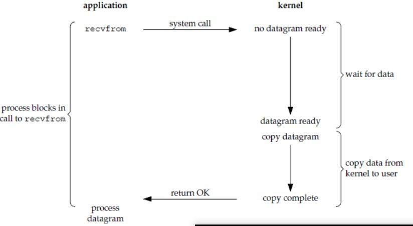
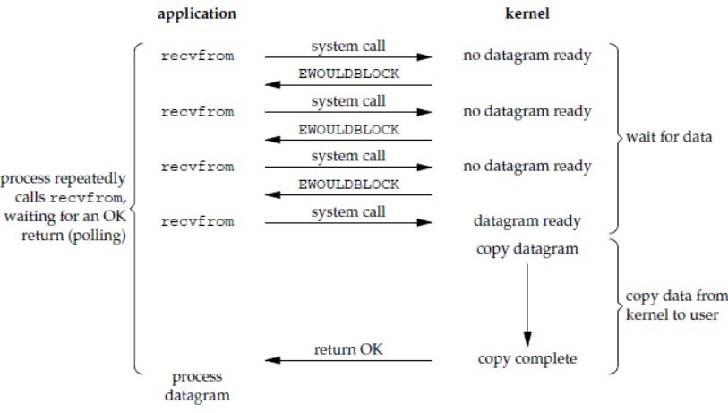
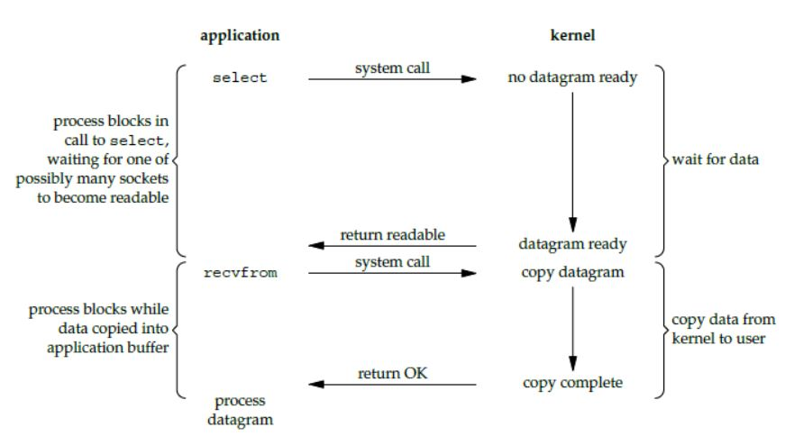
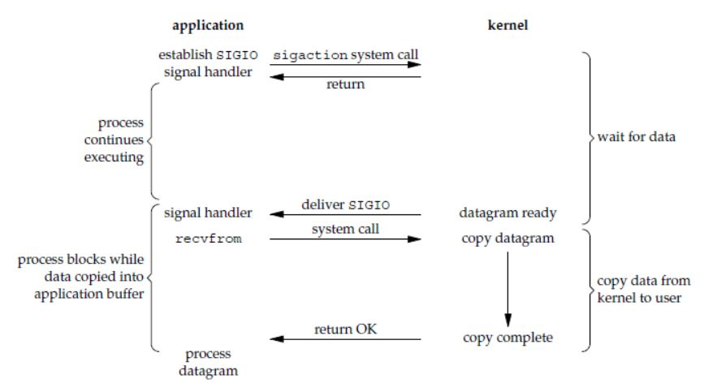

[toc]

## Socket

### 1. API

应用程序与网络协议进行交互的接口

#### 1.1 调用TCP


- 客户端与服务端建立 socket 之后，服务端通过 bind() 监听 某个 IP 地址的端口(服务器拥有多张网卡对应多个 IP，指定 0.0.0.0 则全部监听)，进入连接阶段
- 服务端调用 listen() 进入三次握手的 LISTEN 状态，调用 accept() 等待完成至少一个连接
- 客户端调用 connect() 发起连接
- 成功连接之后，通过 read 和 write 来读写数据，类似操作文件流

注：监听和传输数据为**不同的socket**，分为监听 socket 和 已连接 socket

#### 1.2 调用 UDP


UDP 因为无连接，故不需要 connet() 和 accept()，通信时，调用 sendto() 和 recvfrom()，都要传入 IP 地址和端口


### 2. Linux 的五种 I/O模型

#### 2.1 阻塞式 I/O

在数据从内核缓冲区复制到进程缓冲区之前，进程都被阻塞，阻塞进程不会使用 CPU，socket 的默认模式



#### 2.2 非阻塞式 I/O

执行系统调用后，内核返回一个错误码，应用进程继续执行，但需要**轮询**检验 I/O 情况(注：数据拷贝时仍是阻塞的)



#### 2.3 I/O 多路复用

等待多个 I/O 中的一个完成，等待过程被阻塞，令单进程具有处理多个 I/O 事件的能力，又称事件驱动I/O， select/poll/epoll 使用的模式



#### 2.4 信号驱动 I/O

进程使用 sigaction 系统调用，内核立即返回，应用进程可以继续执行，等待过程是非阻塞的。I/O 可以开始进行时内核向进程发送 SIGIO 信号，进程在信号处理程序中调用 recvfrom



#### 2.5 异步 I/O


进程执行 aio_read 系统调用，内核立即返回，进程不会阻塞，内核在 I/O 完成之后向进程发送信号。

异步 I/O 与信号驱动 I/O 的区别：异步 I/O 通知进程 I/O 完成，信号驱动 I/O 通知进程可以开始 I/O。


### 3. select/poll/epoll

#### 3.1 select

``` c
int select(int n, fd_set *readfds, fd_set *writefds, fd_set *exceptfds, 
           struct timeval *timeout);
```

- fd_set 使用数组实现，数组大小使用 **FD_SETSIZE** 定义，所以只能监听少于 FD_SETSIZE 数量的描述符。有三种类型的描述符类型：readset、writeset、exceptset，分别对应读、写、异常条件。
- timeout 为超时参数，调用 select 会一直阻塞直到有描述符的事件到达或者等待的时间超过 timeout。
- 成功调用返回结果大于 0，出错返回结果为 -1，超时返回结果为 0。


#### 3.2 poll

``` c
int poll(struct pollfd *fds, unsigned int nfds, int timeout);
```

poll 与 select 功能基本相同，速度较慢，调用需要将全部描述符从进程缓冲区复制到内核缓冲区，并且 poll 的移植性比 select 差

在实现细节上有所不同：

- poll 的描述符是 pollfd 类型的数组，定义如下：

  ``` c
  struct pollfd {
                 int   fd;         /* file descriptor */
                 short events;     /* requested events */
                 short revents;    /* returned events */
             };
  ```

  select 会修改描述符，而 poll 不会；

- select 的描述符类型使用数组实现，FD_SETSIZE 大小默认为 1024，如果要监听更多的话，需要修改 FD_SETSIZE 后重新编译； poll 没有描述符数量的限制；

- poll 提供了更多事件类型，并且对描述符的重复利用上比 select 高。

- 如果一个线程对某个描述符调用了 select 或者 poll，另一个线程关闭了该描述符，会导致调用结果不确定。

  

#### 3.3 epoll

``` c
int epoll_create(int size);
int epoll_ctl(int epfd, int op, int fd, struct epoll_event *event)；
int epoll_wait(int epfd, struct epoll_event * events, int maxevents, int timeout);
```

**epoll_ctl**：向内核注册新的描述符或者是改变文件描述符。描述符在内核中会被维护在一棵红黑树上，I/O 准备好的描述符被添加到链表中管理，进程调用 

**epoll_wait**：得到 I/O 事件完成的描述符

**<font color=red>epoll 特点</font>**：使用在 Linux 系统上，更加灵活，无操作符数量限制，对多线程更加友好，只需要将描述符从进程向内核缓冲区**拷贝一次**，使用链表则不需要进行轮询，**描述符的状态变化需要进行系统调用**

工作模式：

- **LT**：level trigger，默认模式。epoll_wait 检测到描述符事件时通知进程，进程可以不处理，下次调用时 epoll_wait 会继续通知该事件
- **ET**：edge trigger，通知后进程必须立即处理，仅支持 No-Blocking


#### 3.4 应用场景

select：实时性高的场合，select 的 timeout 精度为微妙，而 poll 和 epoll 为毫秒；需要高移植性的场合

poll：大量描述符，短连接的场合

epoll：Linux 平台，大量描述符，并且是长连接。短连接将导致大量系统调用，降低效率