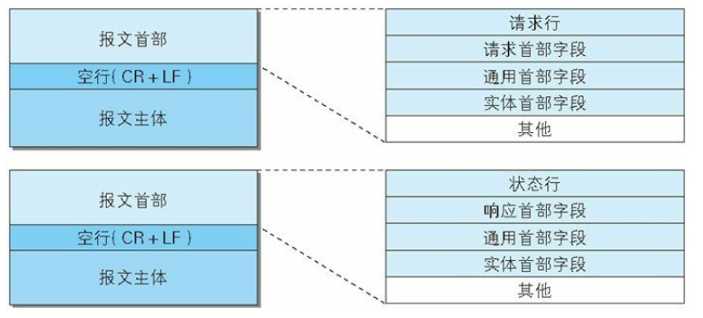
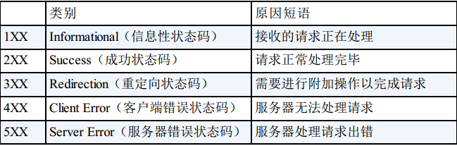
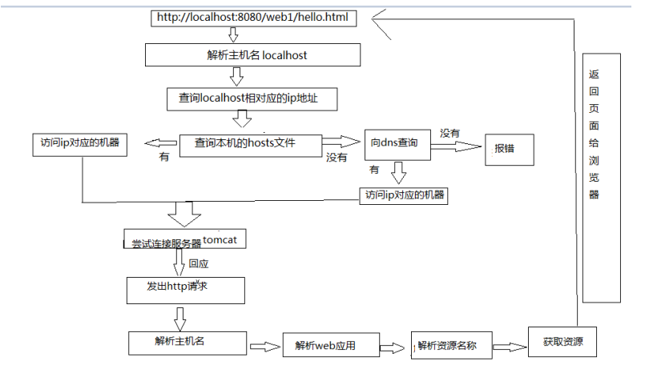
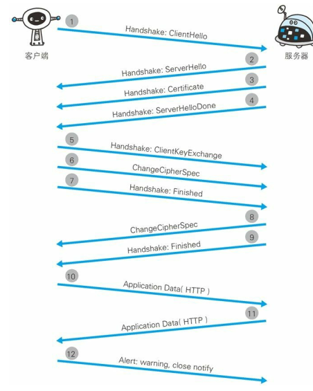

[toc]

## DNS

DNS 即域名系统，提供**主机名与 IP 地址**之间的转换，是一个分布式数据库，每个站点只保留自己的那部分数据

DNS 使用的端口号为 53。通常 DNS 使用 UDP 进行传输，在两种情况下会使用 TCP 进行传输：

- 返回的响应超过的 512 字节（UDP 最大只支持 512 字节的数据）。
- 区域传送（区域传送是主域名服务器向辅助域名服务器传送变化的那部分数据）。

## FTP

FTP 即 文件传送协议，基于 TCP 传输, 端口号为 21

文件传输时，FTP 需要两个并行的 TCP 连接，**控制连接**和**数据连接** (端口号为 20)

## TFTP

TFTP 即简单文件传送协议，基于 UDP 传输，端口号为 69

## HTTP

### 1. 概述

HTTP 即超文本传送协议，基于 TCP 协议

- HTTP 协议自身是无状态的，通过引入 Cookie 与 Session 技术实现状态
- HTTP 1.1 版本提出持久连接( keep-alive)，默认连接为持久连接

### 2. URL 与 URI

**URI**：统一资源标识符，某个协议( http、ftp、mailto 等)表示的资源的定位标识符

**URL**：资源的站点，是 URI 的子集

### 3. HTTP 1.1 方法

- **GET**：请求资源，返回实体
- **POST**：向指定资源提交数据进行处理请求，数据包含在请求体中
- **PUT**：传输文件，但由于不带验证，一般不使用
- **HEAD**：同 GET 方法，但只返回报文头
- **DELETE**：删除文件，不带验证，一般不使用
- **OPTIONS**：查询该资源支持的方法
- **TRACE**：返回请求通信链路
- **CONNECT**：建立隧道，通过 SSL 与 TSL 加密后经隧道传输

### 4. GET 与 POST 的区别

- GET 会将数据附在 URL 之后，以 ? 分割 URL 与数据，参数之间通过 & 连接，POST 将数据放置在HTTP 的请求实体中
- 传输数据大小，虽然 HTTP 协议对数据大小未进行限制，但浏览器对 URL 的长度进行了限制，故 GET传输数据有上限；POST 理论上数据无上限，但实际浏览器还是进行了限制
- GET 是幂等的，只请求数据；POST 是非幂等的，POST 提交的事务可能用于不可逆转的事务(数据库增改等) 

### 5. HTTP 报文

- **组成**

  **请求行**：方法  URL  版本 CRLF (回车换行)，举例: GET [www.baidu.com](http://www.baidu.com/) HTTP/1.1

​       **状态行**：版本 状态码 短语 CRLF，举例：HTTP/1.1 200 Accepted

- **HTTP 状态码**

- **HTTP 报文首部**

   **通用首部字段**：   

   Cache-Control：操作缓存   

   Connection: 功能 1 是控制不再转发给代理的首部字段，

​                         例如 Connection:Upgrade，则代理会从报文首部删除Upgrade   

​                         功能 2 管理持久连接，例如 Connection:close，则关闭连接   

   Upgrade:检查是否能用更高的版本

  **请求首部字段**：  

   Accept:用户支持的媒体类型  

   Accept-Charset:能处理的字符集  

   Accept-Encoding：能处理的内容编码(压缩)  

   Accept-Language：能处理的语言  

   Host:主机名与端口号，必须存在

  **响应首部字段**：  

  Accept-Ranges：能否处理范围请求，bytes 为可，none 不可  

  Location：引导至与请求 URI 不同的资源，一般与状态码 3xx 配合使用

### 6. Cookie 与 Session

Cookie 与 Session 的区别：

- Cookie 存放在客户的浏览器，Session 存放在服务器
- Session 由于 SessionId 的缘故，一般通过 Cookie 实现(非必要，可通过 URL 重写实现)
- Cookie 的生存周期取决于 maxAge，Session在浏览器关闭后消失

### 7. HTTP 请求页面流程

**注**：如果本机还未有 IP 地址，要先进行 **DHCP** 配置主机信息

### 8. HTTPS

HTTPS 在 HTTP 的基础上增加了 **SSL** (改变了 HTTP 的通信接口为 SSL 与 TLS )，提供**非对称加密与证书**服务

HTTPS 通信过程

