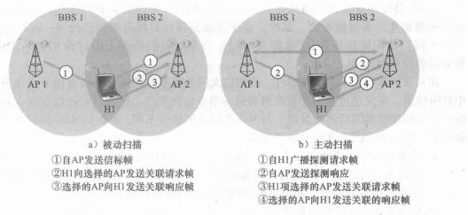

[toc]

## 数据链路层

### 1. 信道类型及其协议

- 点对点信道，采用 PPP 协议

- 广播信道，采用 CSMA/CD 协议

### 2. 三个基本问题

- 封装成帧：将网络层传下来的分组添加帧头、帧尾
- 透明传输：数据部分出现帧头、帧尾部分采用**转义字符 **(类似 C++ 的 '\\')
- 差错检测：采用 CRC (循环冗余检验)检查比特差错

### 3. 概念

- MTU：最大传送单元，帧数据部分的长度上限

- 环回接口：允许同一台主机的客户端与服务器通信，IP 地址为127.0.0.1

- 集线器：工作在物理层，简单转发比特，不会增加吞吐量

- 网桥：工作在数据链路层，转发 MAC 帧，可以增加吞吐量

- MAC 地址：硬件地址，固化在电脑 ROM 中；笔记本支持无线与有线，因此有多个 MAC 地址

  下图为以太网 V2的 MAC帧格式

以太网 V2 版本 MAC 帧中不包含长度，因为传输采用曼彻斯特编码，当电压无变化时，即代表传输结束

### 4. 无线网络

#### 4.1 概述

无线网络的要素：无线主机、无线链路、基站

无线网络分类：

- 单跳、基于基础设施：基站与无线主机通信经过一个无线跳，例如 WIFI、4G；
- 单跳、 无基础设施：不存在无线网络相连的基站，例如蓝牙；
- 多跳、属于基础设施：无线节点与基站通信时，需要经过其他无线节点中继
- 多跳、无基础设施

#### 4.2 WIFI 与 802.11

802.11 的基本构件是基本服务集(Basic Service Set, BSS)，BSS 包括无线站点和接入点 (Access Point, AP)，家用网络中，AP 综合在路由器中

无线站点收发数据时必须与一个 AP 关联，关联方式有主动扫描与被动扫描

802.11 的 MAC 协议为 **CSMA/CA 协议**

