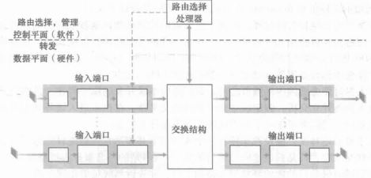

[toc]

## 概述

网络层提供无连接的、尽最大努力交互(即不可靠)的数据报服务。

## 路由器

路由器工作：

- 检查校验和

- 转发分组
- 更新分组的 TTL 

## IP 协议

### 1. IP 协议的作用

将**异构**的物理网络连接起来，看起来像是一个统一的网络

### 2. IP 地址的三个阶段

- **分类的 IP 地址**：将 32 位 IP 地址分为 {网络号，主机号}，根据网络号的位数分为 A、 B、C、D、E 五类网络，现在已不使用

- **子网划分**：增加一个子网号字段，即{网络号，子网号，主机号}，对外统一，对内划分。

  ​                   路由器使用 **子网掩码**与 IP 地址进行与操作，得到子网的网络地址，进行转发

- **无分类地址 CIDR**：更加有效地划分 IP 地址，{网络前缀，主机号}，使用斜线记法标明前缀位数，例如                        128.14.35.7/20，并采用**最长匹配原则**

### 3. IP 数据报格式

各字段：

- **版本**：占 4 位，值为 4 或者 6， 对应 IPv4 与 IPv6

- **首部长度**：占 4 位， 单位为 **32 位字节**，取值范围在 5 - 15，对应 IP 首部 20字节 与 1111

- **区分服务 DS**：占4位，原名为服务类型 TOS，一般情况下不使用

- **总长度**：占 16 位，首部与数据之和的长度，单位是字节，数据报最大长度为 65535 字节，当超过 MTU 的大小时，需要进行分片

- **标识**：占 16 位，分片的 IP 数据报片拥有相同的标识，最后能够进行组装

- **标志**：占 3 位，最低位 MF (More Fragment)，为 1 表示还有分片，为 0 则是最后分片

  ​            中间位 DF (Don't Fragment)，为 1 则不能进行分片

- **片偏移**：占 13 位，该分片在未分片前数据报的起始位置，单位是 **8 个字节**，故分片的长度一定是 8 字节的整数倍

- **生存时间**：占 8 位， 即 TTL，数据报所能经过的跳数，为 0 后该数据报将被路由器丢弃

- **协议**：占 8 位，指出数据报的数据采用的协议，以下是常用协议的字段

  

- **首部检验和**：占 16 位，只对首部进行检验
- **源地址**：32 位，在路由转发过程中不改变(MAC 地址在这过程会变动)
- **目的地址**：32 位，在路由转发过程中不改变

### 4. 路由器分组转发流程

流程如下：

- 从数据报的首部提取目的主机的 IP 地址 D，得到目的网络地址 N。

- 若 N 就是与此路由器直接相连的某个网络地址，则进行直接交付；

- 若路由表中有目的地址为 D 的特定主机路由，则把数据报传送给表中所指明的下一跳路由器；

- 若路由表中有到达网络 N 的路由，则把数据报传送给路由表中所指明的下一跳路由器；

- 若路由表中有一个默认路由，则把数据报传送给路由表中所指明的默认路由器；

- 报告转发分组出错。

  

### 5. IPv6

IPv6 数据报格式：

- 版本：固定为 6
- 流量类型：同 IPv4 的 TOS
- 流标签：标识一条数据报的流，可以设定相应的优先级
- 有效载荷长度：数据报在 40 字节的首部之后的字节数量
- 下一个首部：上层所使用的协议，与 IPv4 中的协议字段作用相同
- 跳限制：即 TTL
- 源地址、目标地址：采用 128 bit

IPv6 的改动：

- 地址由 32 位拓展为 128 位

- 去除分片，如果路由器收到的 IPv6 数据报太大，则丢掉该数据报，返回 “分组太大” 的 ICMP 报文
- 去除校验和，依靠运输层和数据链路层的校验和

## ARP 协议

### 1. 介绍

- **作用**：根据 IP 地址解析出 MAC 地址
- 主机设有 ARP 高速缓存，并进行动态更新，在 Windows 系统可以运行 arp -a 查看缓存

### 2. 工作原理

工作原理见下图，主机 A 通过广播发送 ARP 请求分组，相应 IP 的主机发送响应分组

**注意**：

- ARP 查询报文是广播帧， ARP 响应报文是标准帧

- ARP 协议在 同一个局域网 上工作，如果不在同一局域网，需要通过路由代理：主机 A 将跨局域网的 ARP 请求发送至本局域网网关，由本局域网网关 Agate 构造 ARP 广播帧，发送至目标局域网，目标主机 B 响应 ARP 请求并发送至 Agate，Agate 以单播形式发送给主机 A 

### 其他

RARP 协议：通过 MAC 地址解析 IP，一般用于没有磁盘驱动器的系统，但已经被 DHCP 协议代替

## ICMP 协议

即网际控制报文协议，ICMP 报文作为 IP 数据报的**数据部分**，通过 IP 数据报发送

### 1. ICMP 报文格式

### 2. ICMP 报文种类

ICMP 报文分为**差错报告报文**和**询问报文**

差错报告报文种类

- **终点不可达**：路由器或主机不能交付数据报时，向源点报告
- **源点抑制**：路由器或者主机出现拥塞，让源点降低报文发送速率
- **时间超过**：收到了 TTL 为 0 的数据报
- **参数问题**：数据报首部存在字段错误
- **改变路由(重定向)**：路由器将改变路由报文发送给主机，告知路由器变化情况

询问报文种类

- **回送请求和回答**：用以测试目的站释放可达
- **时间戳请求和回答**：进行时钟同步和测量时间

### 3. Ping

Ping 的原理是通过向目的主机发送 ICMP 回送请求报文，目的主机收到会发送 Echo 回答报文。根据时间和成功响应的次数估算出数据包往返时间以及丢包率

### 4. Traceroute

Traceroute作用：

- 用以跟踪一个分组从源点到终点的路径
- 确定路径上的 MTU：设置不分片后发送一定大小的分组，如果出错则不断减少

Traceroute 发送的 IP 数据报封装的是无法交付的 UDP 用户数据报(端口大于 30000)，运行流程如下

- 源主机向目的主机发送一连串的 IP 数据报。第一个数据报 TTL 设置为 1，到达路径上的第一个路由器 ，路由器收下它并把 TTL 减为0，将数据报丢弃，并向源主机发送一个 ICMP 时间超过差错报告报文；
- 源主机接着发送第二个数据报 ，并把 TTL 设置为 2。先到达 第一个路由器，收下后把 TTL 减 1 再转发给 下一个， 收下后也把 TTL又减为 0，进行相同的操作；
- 不断执行这样的步骤，直到最后一个数据报刚刚到达目的主机，因为数据报无法交付，故向源主机发送 ICMP 终点不可达差错报告报文。
- 源主机知道了到达目的主机所经过的路由器 IP 地址以及到达每个路由器的往返时间。

 